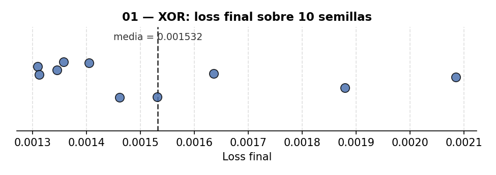
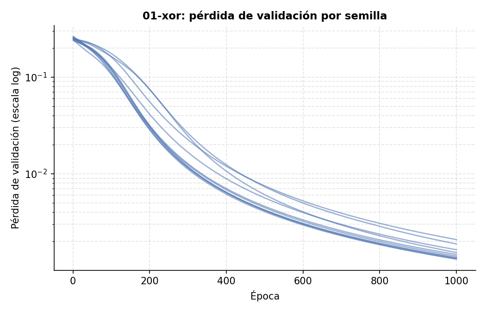

# 01 — Compuerta XOR: el "hola mundo" de las redes neuronales

XOR es el ejemplo clásico para demostrar por qué hacen falta capas ocultas: una sola neurona
(regresión logística/perceptrón) **no puede** separar sus 4 casos porque no son separables
linealmente. Aquí una red con una capa oculta (2 → 16 → 1, LeakyReLU + Sigmoide) sí aprende a
resolverlo, usando el mini-framework de [`../capas.py`](../capas.py) (forward/backward propios,
sin TensorFlow).

XOR solo tiene 4 combinaciones de entrada posibles — son el universo completo del problema, no
una muestra. No hay train/test split: el objetivo no es medir generalización a datos nuevos,
sino comprobar que la red representa una frontera de decisión no lineal.

## Resultado

Loss final **0.0016** tras 1000 épocas, **4/4 aciertos**:

| Entrada | Objetivo | Predicción |
|---|---|---|
| [0,0] | 0 | 0.0551 |
| [0,1] | 1 | 0.9651 |
| [1,0] | 1 | 0.9666 |
| [1,1] | 0 | 0.0341 |


**Visualización de datos — frontera de decisión aprendida**: el fondo de color muestra qué
predice la red en cada punto del plano, no solo en los 4 puntos de entrenamiento. Se ve
claramente la forma no lineal (una franja diagonal) que separa las clases 0 y 1 — la prueba
visual de por qué hacía falta una capa oculta.


**Matriz de confusión** (sobre los 4 únicos casos posibles, calculada a mano con NumPy, sin
`sklearn`, para mantener el proyecto 100% NumPy de principio a fin): diagonal perfecta, 2/2 en
cada clase y ninguna celda fuera de la diagonal — no hay ningún error que explicar, es el
reflejo directo de la tabla de aciertos de arriba (las 4 predicciones ya redondeadas a su
clase). Con solo 4 combinaciones y una red entrenada hasta un loss de 0.0021, no queda margen
para confusión.


## Robustez frente a la semilla

`np.random.seed(SEED)` gobierna varias cosas distintas a la vez (qué pesos iniciales salen, en
qué orden se procesan los datos...), así que un único run con una sola semilla no dice si el
resultado es representativo o si tuvo suerte con esa semilla en concreto. Aquí se separan en
`seed_split` (sin efecto en este proyecto: las 4 combinaciones de XOR son el universo completo,
no hay split que hacer) y `seed_modelo` (gobierna la inicialización de los pesos), y se repite
el entrenamiento con **10 semillas de inicialización distintas**, sorteadas de forma
independiente (`python run_seed_sweep.py --solo 01-xor`, ver [README raíz](../README.md) para
la metodología completa):

| Métrica | Media | Desv. típica | Mínimo | Máximo | N semillas |
|---|---|---|---|---|---|
| Loss final | 0.0017 | 0.0006 | 0.0013 | 0.0024 | 10 |





La red converge de forma consistente independientemente de la inicialización, coherente con ser
el problema más simple del repositorio.

## Reproducir

```bash
pip install -r ../requirements.txt
python xor_gate.py
```

## Limitaciones

- Con solo 4 combinaciones de entrada posibles, "accuracy" y "matriz de confusión" no miden
  generalización (no hay datos nuevos que mostrar) — miden si la red representó correctamente
  la función lógica completa.
