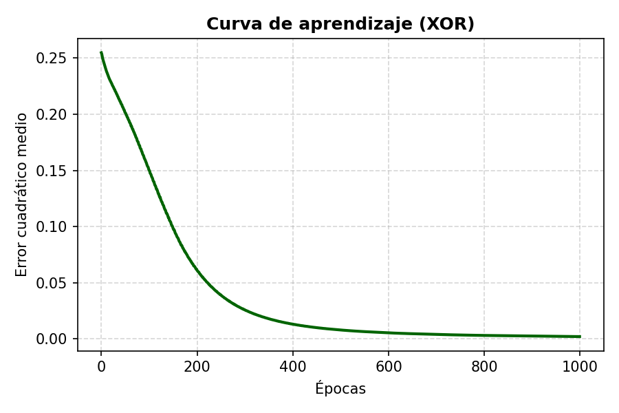
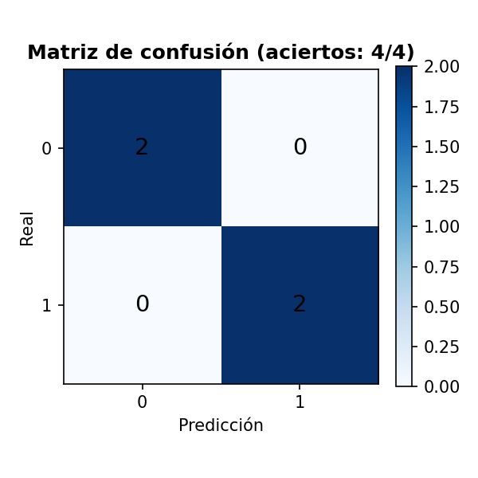

# 01 — Compuerta XOR: el "hola mundo" de las redes neuronales

XOR es el ejemplo clásico para demostrar por qué hacen falta capas ocultas: una sola neurona
(regresión logística/perceptrón) **no puede** separar sus 4 casos porque no son separables
linealmente. Aquí una red con una capa oculta (2 → 16 → 1, LeakyReLU + Sigmoide) sí aprende a
resolverlo, usando el mini-framework de [`../capas.py`](../capas.py) (forward/backward propios,
sin TensorFlow).

XOR solo tiene 4 combinaciones de entrada posibles — son el universo completo del problema, no
una muestra. No hay train/test split: el objetivo no es medir generalización a datos nuevos,
sino comprobar que la red representa una frontera de decisión no lineal.

## Resultado

Loss final **0.0021** tras 1000 épocas, **4/4 aciertos**:

| Entrada | Objetivo | Predicción |
|---|---|---|
| [0,0] | 0 | 0.0405 |
| [0,1] | 1 | 0.9401 |
| [1,0] | 1 | 0.9648 |
| [1,1] | 0 | 0.0448 |



**Visualización de datos — frontera de decisión aprendida**: el fondo de color muestra qué
predice la red en cada punto del plano, no solo en los 4 puntos de entrenamiento. Se ve
claramente la forma no lineal (una franja diagonal) que separa las clases 0 y 1 — la prueba
visual de por qué hacía falta una capa oculta.


**Matriz de confusión** (sobre los 4 únicos casos posibles, calculada a mano con NumPy, sin
`sklearn`, para mantener el proyecto 100% NumPy de principio a fin): diagonal perfecta, 2/2 en
cada clase y ninguna celda fuera de la diagonal — no hay ningún error que explicar, es el
reflejo directo de la tabla de aciertos de arriba (las 4 predicciones ya redondeadas a su
clase). Con solo 4 combinaciones y una red entrenada hasta un loss de 0.0021, no queda margen
para confusión.



## Reproducir

```bash
pip install -r ../requirements.txt
python xor_gate.py
```

## Limitaciones

- Con solo 4 combinaciones de entrada posibles, "accuracy" y "matriz de confusión" no miden
  generalización (no hay datos nuevos que mostrar) — miden si la red representó correctamente
  la función lógica completa.
