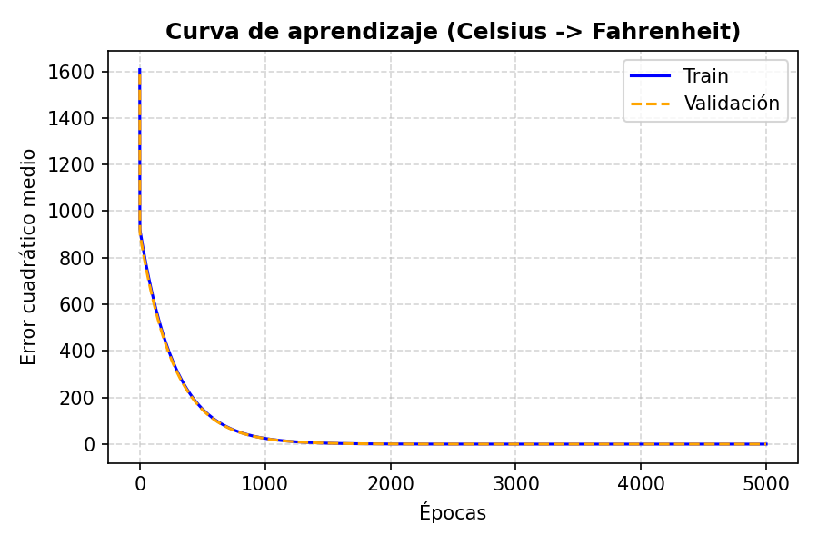
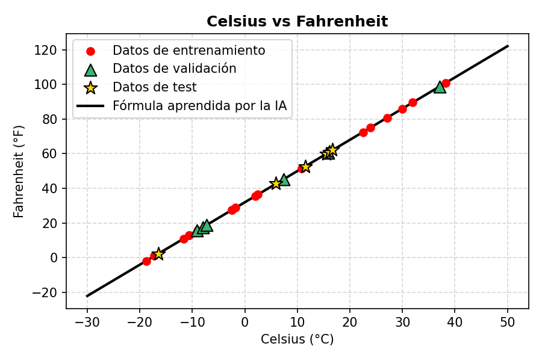
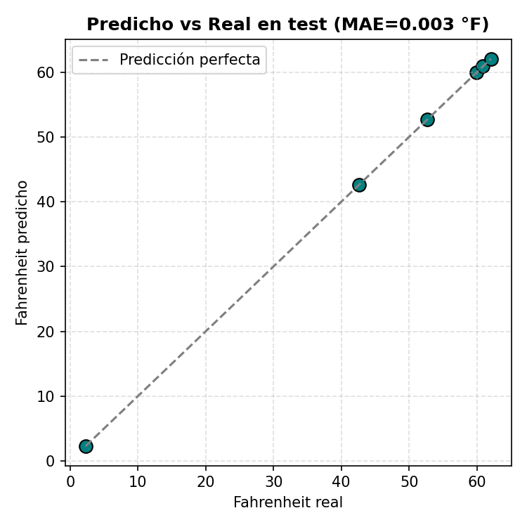

# 02 — Celsius → Fahrenheit: regresión con una sola neurona

El ejemplo de regresión más simple posible: una sola neurona lineal (`A = X·W + b`, sin
activación) que descubre la fórmula de conversión **únicamente a partir de ejemplos**
(temperatura en C, temperatura en F) — nunca se le da la fórmula `F = C·1.8 + 32`.

Es un problema de **regresión** (predice un número continuo), así que no aplica una matriz de
confusión — el veredicto es cuánto se parece la fórmula que la red dedujo a la fórmula física
real, medido en un conjunto de test separado.

## Split en tres partes: train / validación / test

De los 30 ejemplos: 18 de entrenamiento (60%), 6 de validación (20%, es lo que decide cuándo
activar el early stopping) y 6 de test (20%, la red no los ve nunca hasta la evaluación
final, una sola vez). El early stopping mira el error de **validación**, nunca el de test —
así la cifra final de test es una estimación limpia, no contaminada por ninguna decisión de
entrenamiento. Ver "Metodología: por qué train / validación / test" en el
[README raíz](../README.md) si quieres el porqué completo de este split de tres partes.

## Resultado

Tras 5000 épocas sobre 18 ejemplos de entrenamiento (evaluado sobre 6 de test nunca vistos,
ni siquiera durante la decisión de cuándo parar):

- **W aprendido: 1.8001** (valor real: 1.8)
- **b aprendido: 31.9963** (valor real: 32.0)
- **MAE en test: 0.0032 grados F** — prácticamente exacto



### ¿Por qué no para antes si "ya no mejora" a partir de la época 1500?

Este proyecto incluye early stopping (corta el entrenamiento si el error de **validación**
lleva 200 épocas sin mejorar al menos un 0.5%) y aun así **llega a las 5000 épocas sin
activarse**. La curva de arriba parece plana a partir de la época ~1500 porque el eje Y es
lineal y el error arranca altísimo (~1600): en esa escala, pasar de un error de 3.5 a uno de
0.00001 es invisible a simple vista, aunque siga siendo una reducción de varios órdenes de
magnitud. El descenso de gradiente sobre este problema (una recta, sin ruido en los datos)
converge de forma geométrica: el error se reduce por un factor constante cada cierto número
de épocas indefinidamente, así que en términos relativos **nunca deja de mejorar** — solo deja
de notarse en un gráfico de escala lineal. Es lo contrario de lo que pasa en
[`05-precio-casas`](../05-precio-casas/) o [`04-prediccion-temperatura-dia-noche`](../04-prediccion-temperatura-dia-noche/),
donde los datos sí tienen ruido y el error de validación alcanza un suelo real (no se puede
predecir mejor que el propio ruido) — ahí el early stopping sí se activa, y mucho antes del
límite de épocas configurado.

**Visualización de datos**: los puntos rojos son los datos de entrenamiento, los triángulos
verdes los de validación, las estrellas doradas los de test, y la línea negra es la fórmula
que la red dedujo por sí sola.



**"Matriz" (equivalente para regresión)**: al ser un problema de regresión, no aplica una
matriz de confusión (no hay clases que confundir). El equivalente honesto es predicho-vs-real
sobre el conjunto de test — cuanto más pegados estén los puntos a la diagonal, mejor:



### Train vs validación: ¿por qué una curva no es claramente mejor que la otra?

En `results/metrics.json`, el MSE final de train (1.24e-5) y el de validación (1.22e-5) son
casi idénticos, y test termina aún más bajo (1.08e-5) — no hay una curva que sea
sistemáticamente "mejor". Esto tiene una explicación concreta y no es casualidad ni un error:
los datos son perfectamente lineales y sin ruido (`F = C·1.8 + 32` exacto), así que no existe
ningún patrón "extra" que memorizar de más en train — no hay hueco de generalización que
abrir. La única fuente de error que queda a estas alturas del entrenamiento es que, tras 5000
épocas, `W` y `b` todavía no son *exactamente* 1.8 y 32 (les falta una última fracción decimal
por converger). Ese pequeño error residual en los parámetros se traduce en un error de
predicción proporcional a `|X|` (cuanto más lejos de 0 esté la temperatura, más se nota un `W`
ligeramente desviado). Con la semilla 42, el reparto aleatorio de este proyecto deja en test
los valores de Celsius con menor magnitud media en valor absoluto (~13.7°C) frente a
validación (~14.1°C) y train (~15.2°C) — así que ese error residual, aunque el mismo `W`/`b`
se aplique a los tres conjuntos, se nota menos en test simplemente porque sus `X` son más
pequeños en valor absoluto. Con otra semilla de reparto el resultado podría salir al revés; el
punto importante es que la diferencia entre estas curvas aquí no mide "generalización" (no hay
nada que generalizar en una fórmula exacta) sino ruido de convergencia finita combinado con
qué valores de X le tocaron a cada conjunto.

## Reproducir

```bash
pip install -r ../requirements.txt
python celsius_fahrenheit.py
```

## Limitaciones

- Con solo 30 ejemplos en total, un split de tres partes deja validación y test en 6 ejemplos
  cada uno — suficiente para ilustrar el mecanismo, pero la cifra de MAE en test tiene alta
  varianza (con otra semilla de reparto podría salir sensiblemente distinta). El punto de este
  proyecto es demostrar la mecánica de la regresión y el split correcto, no una estimación de
  error robusta.
