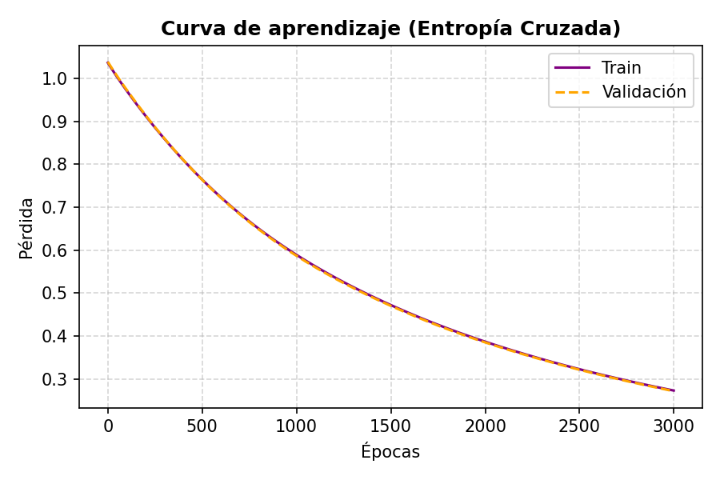
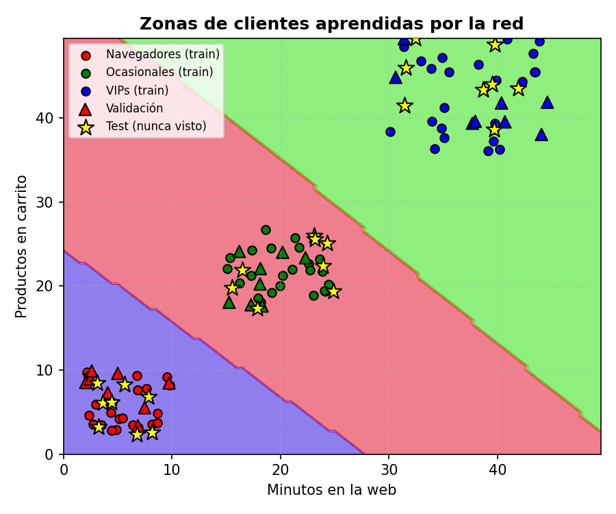
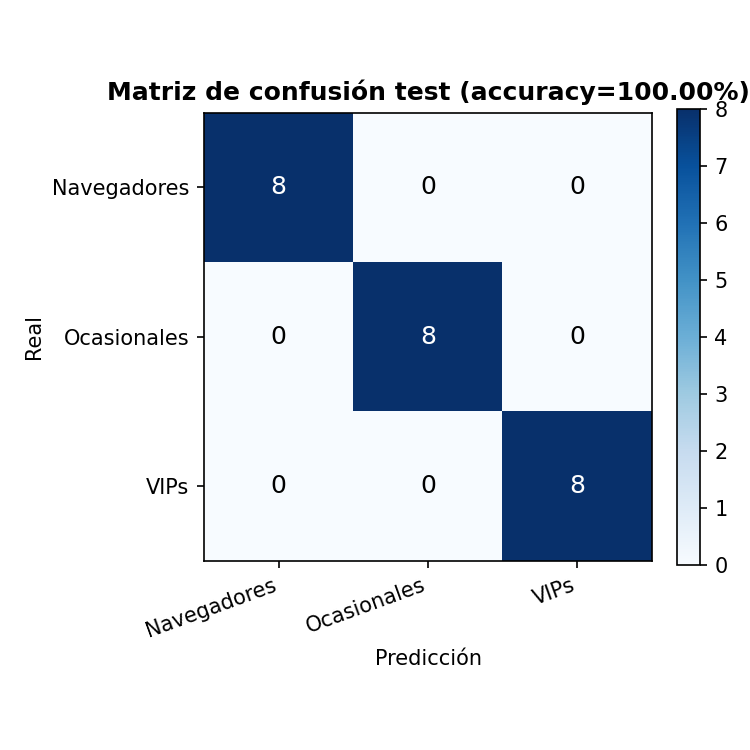

# 03 — Clasificador de tipos de cliente (3 categorías)

Clasifica clientes de una tienda online en 3 categorías (Navegadores, Ocasionales, VIPs) a
partir de 2 variables: minutos navegando y productos en el carrito. Red modular
(Densa → LeakyReLU → Densa → Softmax) entrenada con entropía cruzada.

Split en tres partes -- 60% train / 20% validación / 20% test, estratificado por categoría --
con early stopping que decide cuándo parar mirando el error de VALIDACIÓN, nunca el de test.
El test se toca una única vez, al final, con la red ya congelada, para medir generalización
real con una matriz de confusión sobre clientes nunca vistos en el entrenamiento.

## Bug corregido: faltaba normalizar los datos

Una primera versión de este proyecto pasaba minutos y productos a la red **sin normalizar**,
con valores de hasta ~50. Con esa escala, el descenso de gradiente converge tan despacio que
ni siquiera llegaba a separar bien las clases (~93% de acierto evaluado sobre los propios
datos de entrenamiento). El síntoma era confundir "Ocasionales" con "VIPs" en la matriz de
confusión, pese a que las 3 categorías **no se solapan en ninguna de las 2 variables**
(minutos: 2–10 / 15–25 / 30–45; productos: 0–10 / 17–27 / 36–51) — con clases así de
separadas, una red que converge bien no debería fallar nunca. Añadiendo una normalización
min-max estándar (con el mínimo/máximo del conjunto de train, nunca del de test, para no
filtrar información) y sin tocar ningún otro hiperparámetro, la red pasa de ~90% a **100% de
accuracy en test**.

## Resultado

**Accuracy en test: 100%** (24 clientes de test, de 120 en total: 72 train / 24 val / 24
test), tras 3000 épocas -- el problema está tan bien separado que el early stopping no llega
a activarse, la red converge sin overfitting dentro del propio presupuesto de épocas.



**Visualización de datos — zonas aprendidas**: el fondo de color muestra en qué categoría
clasificaría la red cualquier punto del plano. Los triángulos son los clientes de validación
(deciden cuándo parar, pero nunca entran en el gradiente) y las estrellas amarillas son los
clientes de test (nunca vistos hasta la evaluación final) — todos caen dentro de la zona de su
color correcto, y la frontera entre zonas pasa limpiamente por el hueco vacío entre las 3 nubes
de puntos.



**Matriz de confusión (test)**: con clases perfectamente separables y la red ya convergida,
la matriz es una diagonal perfecta — cada uno de los 8 clientes de test de cada categoría cae
en su celda "real = predicción" (Navegadores→Navegadores, Ocasionales→Ocasionales,
VIPs→VIPs) y las celdas fuera de la diagonal están todas a 0, es decir, cero errores:



## Reproducir

```bash
pip install -r ../requirements.txt
python customer_classifier.py
```

## Limitaciones

- Dataset sintético con categorías generadas por rangos con algo de solape intencionado (para
  que el problema no sea trivial) — no son datos reales de una tienda.
