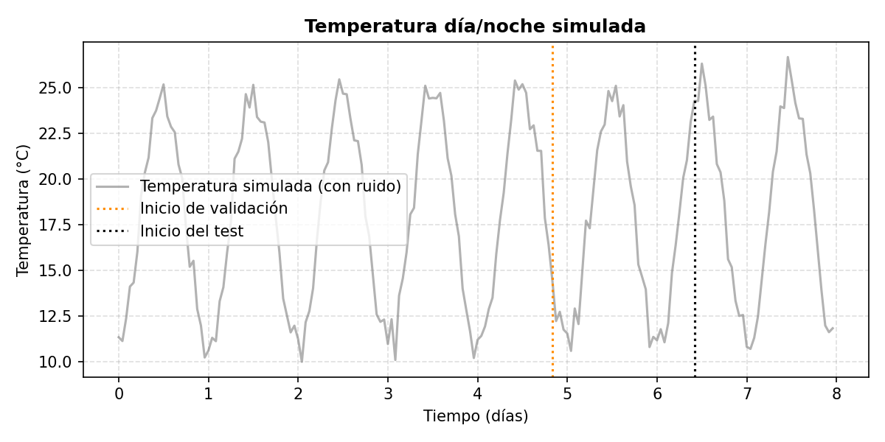
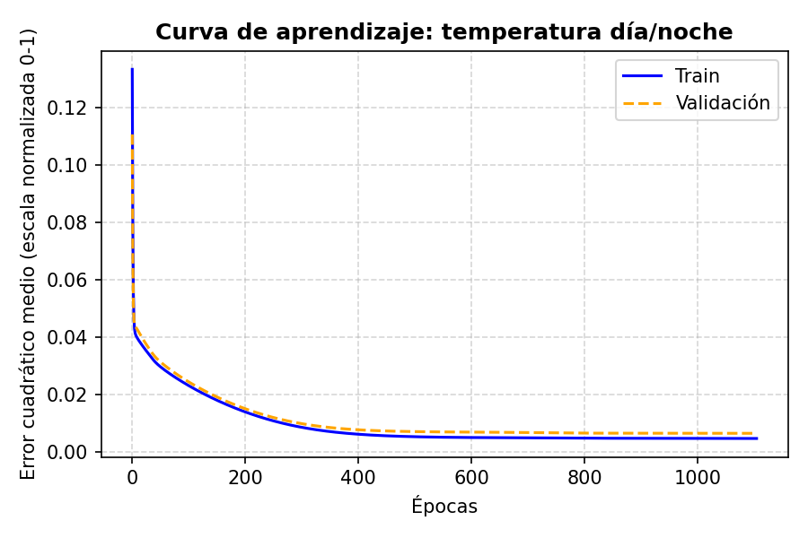
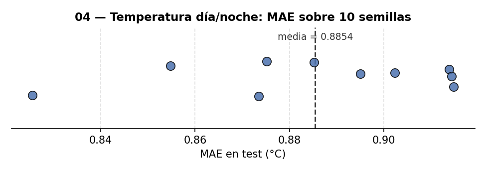
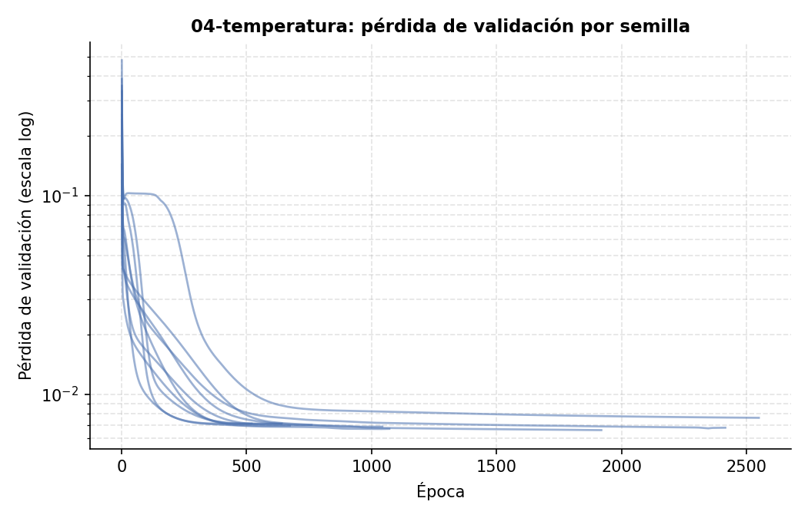

# 04 — Predicción de temperatura día/noche

Una red densa mira las últimas 3 horas de temperatura y predice la hora siguiente — la técnica
de "ventana deslizante" para convertir una serie temporal en un problema de regresión
supervisado.

Es un problema de **regresión** sobre el futuro, así que no aplica una matriz de confusión. El
split respeta el orden temporal en sus tres partes — **train** (60%) / **validación** (20%,
decide el early stopping) / **test** (20%, se evalúa una sola vez, al final) — siempre en ese
orden cronológico: mezclar aleatoriamente aquí sería trampa, la red podría interpolar en vez
de predecir el futuro real. Ver "Metodología" en el [README raíz](../README.md) para el
porqué de separar validación de test.

> Este proyecto se llamaba antes "secuencias temporales" — el nombre no decía qué predice
> realmente. Además, la primera versión generaba una onda `sin(t)` genérica (valores entre -1
> y 1 sin unidad física) y la etiquetaba como "temperatura" solo en el texto; ahora los datos
> son realmente temperatura en grados Celsius, con un ciclo día/noche físicamente coherente
> (mínimo de madrugada, máximo a mediodía) y ruido en las mismas unidades.

## Los datos: temperatura horaria sintética

- 8 días de lecturas horarias (24 puntos/día, 192 en total).
- Ciclo día/noche: `18°C - 7°C·cos(2π·día)` — mínimo ~11°C a medianoche, máximo ~25°C a
  mediodía — más ruido gaussiano de desviación 0.7°C para que no sea una curva perfecta.
- `VENTANA = 3`: la red mira las últimas **3 horas** para predecir la temperatura de **la hora
  siguiente**. No mira días completos ni predice días — cada paso hacia el futuro en los
  gráficos de abajo es 1 hora.



## Resultado

Con early stopping activado (ver README de
[`05-precio-casas`](../05-precio-casas/) para la explicación general del criterio, es el mismo
aquí), entrenado sobre 113 horas, validado sobre 38 y evaluado sobre 38 horas de test (las
últimas cronológicamente, nunca vistas ni usadas para decidir nada):

- **Corte del early stopping: época 1105** de 3000 configuradas (techo de seguridad, no un
  objetivo) — el error de **validación** llevaba 200 épocas sin mejorar un 0.5%. Los pesos
  usados para evaluar son los de la **época 1014**, el mínimo real de `loss_val`, restaurado
  por checkpoint (ver "Checkpoint del mejor punto de validación" en el
  [README raíz](../README.md)).
- **MAE en test: 0.88 °C** — próximo al ruido de fondo (0.7 °C de desviación), indicando que
  la red aprendió el patrón cíclico real y no solo está memorizando.

**Contra qué comparar ese 0.88 °C**: el ruido de fondo (0.7 °C) es el suelo teórico -- ningún
modelo puede bajar de ahí de forma sistemática, porque esa parte del error es aleatoria por
construcción. Pero el techo también importa, y para eso hace falta un baseline ingenuo, no solo
el suelo de ruido: predecir que la hora siguiente va a ser igual a la última hora observada
(baseline de persistencia, sin entrenar nada) da **MAE 1.33 °C** en este mismo conjunto de
test -- el error de la red (0.88 °C) es un 34% menor, así que sí está aprendiendo el ciclo
día/noche, no solo copiando el último valor.



**Predicción vs realidad en test**: eje X en horas reales desde el inicio del test (no un
índice sin unidades) y eje Y en grados Celsius reales (no un valor normalizado entre -1 y 1
sin significado, como en la versión anterior de este proyecto). La predicción seguía de cerca
el ciclo día/noche real, incluyendo el pico y el valle que nunca vio durante el entrenamiento:


## Robustez frente a la semilla

El split aquí es cronológico (train/val/test en orden temporal fijo), no aleatorio, así que
solo la inicialización de pesos (`seed_modelo`) puede mover el resultado. Repitiendo el
entrenamiento con **10 semillas de inicialización distintas**
(`python run_seed_sweep.py --solo 04-temperatura`, ver [README raíz](../README.md)):

| Métrica | Media | Desv. típica | Mínimo | Máximo | N semillas |
|---|---|---|---|---|---|
| MAE en test (°C) | 0.89 | 0.03 | 0.83 | 0.91 | 10 |





Muy estable — consistente con ser un problema de regresión suave (una neurona ve solo 3 valores
de entrada) y sin el ruido de un split aleatorio que sí afecta a otros proyectos del
repositorio.

## Reproducir

```bash
pip install -r ../requirements.txt
python temperatura_dia_noche.py
```

## Limitaciones

- Datos sintéticos (ciclo coseno + ruido gaussiano), no temperaturas reales medidas.
- El eje Y de la curva de aprendizaje (`learning_curve.png`) sigue en la escala normalizada
  0-1 en la que entrena la red, no en °C directamente — es el error cuadrático medio sobre los
  datos ya escalados a [0,1], útil para comparar train vs validación, pero no se puede leer
  como grados. El MAE en °C reportado arriba sí está desnormalizado a la escala real.
- Con un split de tres partes sobre solo 189 horas totales, validación y test quedan en 38
  horas cada uno — suficiente para ilustrar el mecanismo, pero con más varianza que un
  dataset más grande.
