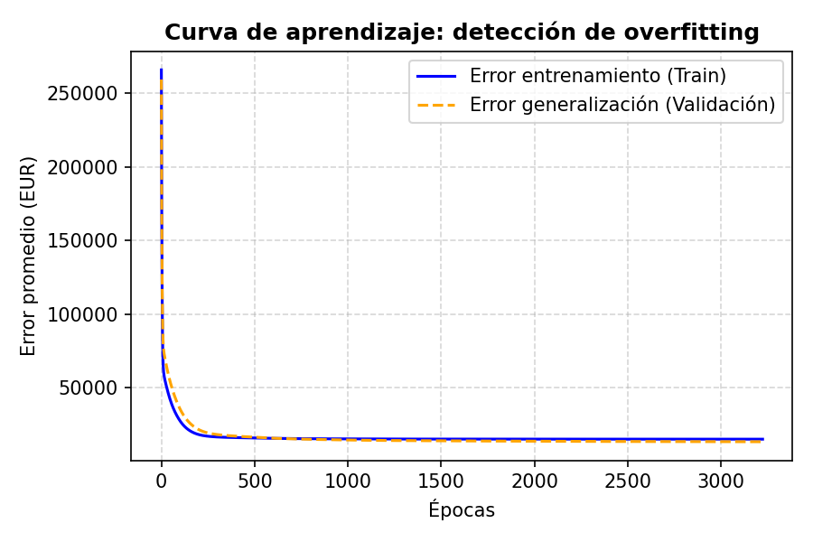
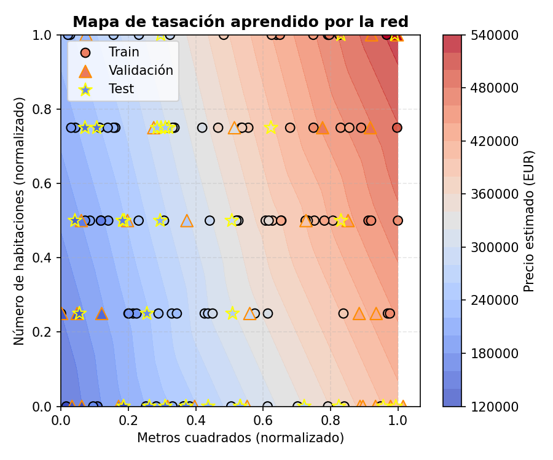
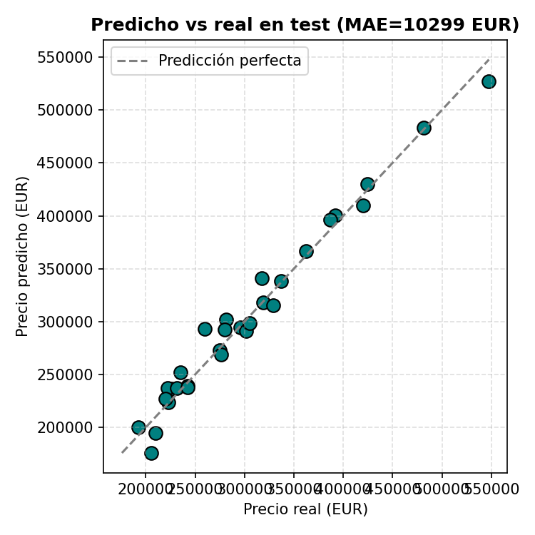
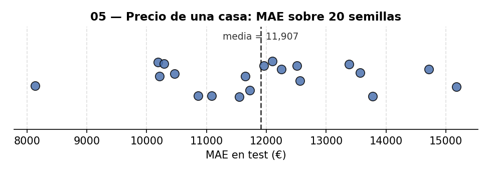
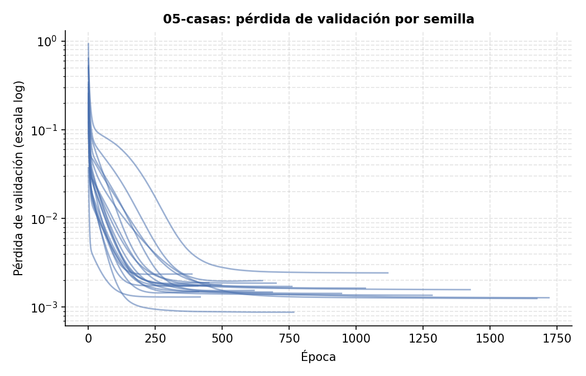

# 05 — Predicción del precio de una casa

Predice el precio de una vivienda a partir de 2 variables: metros cuadrados y número de
habitaciones. Red modular (Densa → LeakyReLU → Densa lineal) con un split train / validación /
test para poder comparar el error de train contra el de **validación** época a época y
detectar overfitting — si el error de validación empezara a subir mientras el de train sigue
bajando, sería la señal de que la red está memorizando en vez de generalizar. El conjunto de
test no participa en esa decisión: se evalúa una sola vez, al final, con la red ya congelada
(ver "Metodología" en el [README raíz](../README.md) para el porqué de separar validación de
test).

Es un problema de **regresión** (predice un precio en euros), así que no aplica una matriz de
confusión.

## Resultado

De las 150 casas: 90 de entrenamiento (60%), 30 de validación (20%, decide el early stopping)
y 30 de test (20%, evaluadas una sola vez):

- **MAE en test: 10.299 €** — coherente con el ruido gaussiano (desviación 15.000 €) añadido
  deliberadamente a los datos sintéticos, lo que indica que la red aprendió la relación real
  precio = f(metros, habitaciones) tan bien como el ruido de los datos permite.



## ¿Hacía falta una red neuronal para esto? Comparación con regresión lineal

Los datos se generan con una fórmula exactamente lineal (precio = metros×1.500 +
habitaciones×25.000 + 50.000 + ruido gaussiano), así que la pregunta honesta es si la red
aporta algo frente al modelo más simple posible para este problema. Se ajustó una regresión
lineal ordinaria (mínimos cuadrados, `np.linalg.lstsq`, sin ninguna capa ni descenso de
gradiente) sobre las mismas 90 casas de train, evaluada sobre las mismas 30 de test:

| Modelo | MAE en test |
|---|---|
| Regresión lineal (OLS) | 11.470 € |
| Red neuronal (Densa → LeakyReLU → Densa) | **10.299 €** |

**Las dos están prácticamente empatadas** (1.171 € de diferencia, ~10%) — y, como se ve en la
sección de robustez más abajo, esa diferencia es mucho menor que la varianza que introduce por
sí sola la semilla de split/inicialización (desviación típica ±1.696 € sobre 20 semillas): en
otro reparto de los datos perfectamente podría ganar la regresión lineal, como pasaba en una
versión anterior de este análisis. No hay que leer "quién gana en este split concreto" como una
conclusión fuerte. Lo que sí es sólido es que ambas están en el mismo orden de magnitud, lo cual
tiene sentido y no es un fallo del proyecto: la relación real es lineal, así que el estimador
óptimo para datos lineales con ruido gaussiano aditivo es, precisamente, la regresión lineal
(sus coeficientes ajustados -- 1.511 €/m² y 24.016 €/habitación -- quedan cerca de los reales,
1.500 y 25.000). La capa oculta de la red no tiene ninguna no-linealidad real que aprender
aquí: en el mejor caso converge hacia la misma solución lineal, y en la práctica trae más
parámetros que ajustar con solo 90 ejemplos sin ninguna ventaja estructural a cambio.

Este es el resultado honesto, no uno maquillado para "vender" la red: el objetivo de este
proyecto es demostrar el mecanismo de descenso de gradiente con backpropagation y una
metodología de train/validación/test correcta sobre un problema de regresión con overfitting
real que detectar (ver la sección de early stopping abajo) -- no batir a un baseline lineal en
un problema que es literalmente lineal por construcción. Si el objetivo fuera solo minimizar el
error en este dataset concreto, cualquiera de los dos modelos sirve igual de bien; la ventaja de
la red sería aprender relaciones no lineales que aquí, por construcción, no existen.

### Early stopping: parar en cuanto deja de mejorar de verdad

Con 4000 épocas configuradas (techo de seguridad, no un objetivo), el entrenamiento **corta en
la época 3225** — el error de **validación** lleva 200 épocas sin bajar al menos un 0.5%, así
que seguir no aporta nada. Los pesos usados para evaluar son los de la época **3222**, el
mínimo real de `loss_val`, restaurado por checkpoint (ver "Checkpoint del mejor punto de
validación" en el [README raíz](../README.md)) — prácticamente el mismo punto que el de corte,
porque aquí el error de validación deja de mejorar de forma bastante abrupta.

Esto es distinto de lo que pasa en [`02-celsius-fahrenheit`](../02-celsius-fahrenheit/): ahí los
datos no tienen ruido y el error sigue bajando (aunque de forma invisible en una gráfica lineal)
indefinidamente, así que el early stopping nunca se activa. Aquí sí hay ruido gaussiano real en
los precios (desviación 15.000 €), así que existe un suelo de error que no se puede bajar por
mucho que se entrene — en cuanto la red lo alcanza, seguir entrenando no mejora nada. El
criterio concreto: se compara el error de validación actual contra el de 200 épocas atrás, y si
la mejora relativa en toda esa ventana es menor al 0.5% se corta el entrenamiento
(`epochs_entrenadas` en `results/metrics.json` guarda la época real de corte, `epoca_mejor_val`
la de los pesos realmente usados).

**Visualización de datos — mapa de tasación aprendido**: el fondo de color muestra el precio
que la red asignaría a cualquier combinación de metros/habitaciones. Los puntos son las casas
reales (círculos = train, triángulos = validación, estrellas = test), coloreados por su precio
real — si el punto tiene un color parecido al fondo que pisa, la red acertó.



**"Matriz" (equivalente para regresión)**: no aplica confusión. Predicho vs real en el
conjunto de test:



## Robustez frente a la semilla

Repitiendo el entrenamiento con **20 pares (seed_split, seed_modelo) sorteados de forma
independiente** (`python run_seed_sweep.py --solo 05-casas --n 20`, ver
[README raíz](../README.md)), manteniendo siempre las mismas 150 casas (`SEED_DATOS` fijo):

| Métrica | Media | Desv. típica | Mínimo | Máximo | N semillas |
|---|---|---|---|---|---|
| MAE en test (€) | 11.907 | 1.696 | 8.136 | 15.178 | 20 |





El MAE de la ejecución canónica documentada arriba (10.299 €) sigue en el extremo bueno de ese
rango (mejor que 16 de las 20 semillas), aunque ya no tan cerca del mínimo absoluto (8.136 €)
como sugería la muestra más pequeña — con solo 30 casas de test, qué 30 concretas caen ahí pesa
bastante en el resultado final. Es la razón por la que la comparación con la regresión lineal de
la sección anterior no se puede leer como un veredicto definitivo: la diferencia entre ambos
modelos (~1.171 €) sigue siendo menor que la propia desviación típica de la red frente a la
semilla (1.696 €).

## Reproducir

```bash
pip install -r ../requirements.txt
python house_price.py
```

## Limitaciones

- Datos sintéticos (fórmula lineal conocida + ruido gaussiano), no precios reales de mercado.
