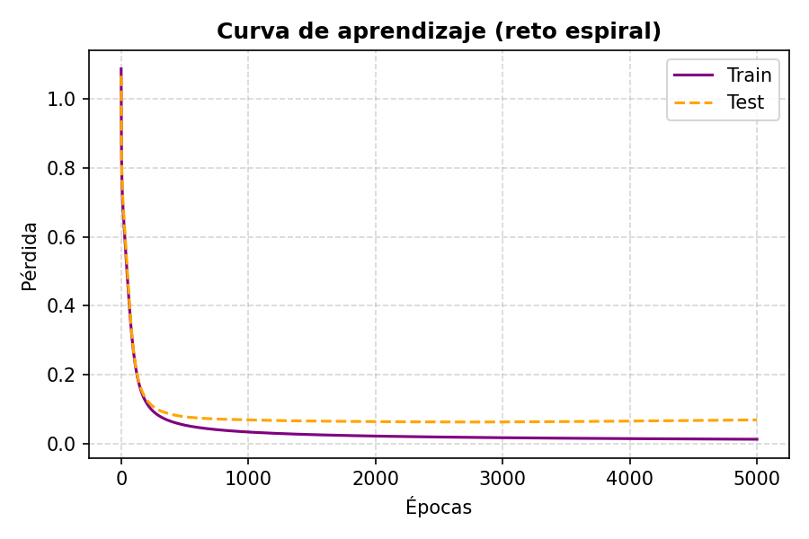
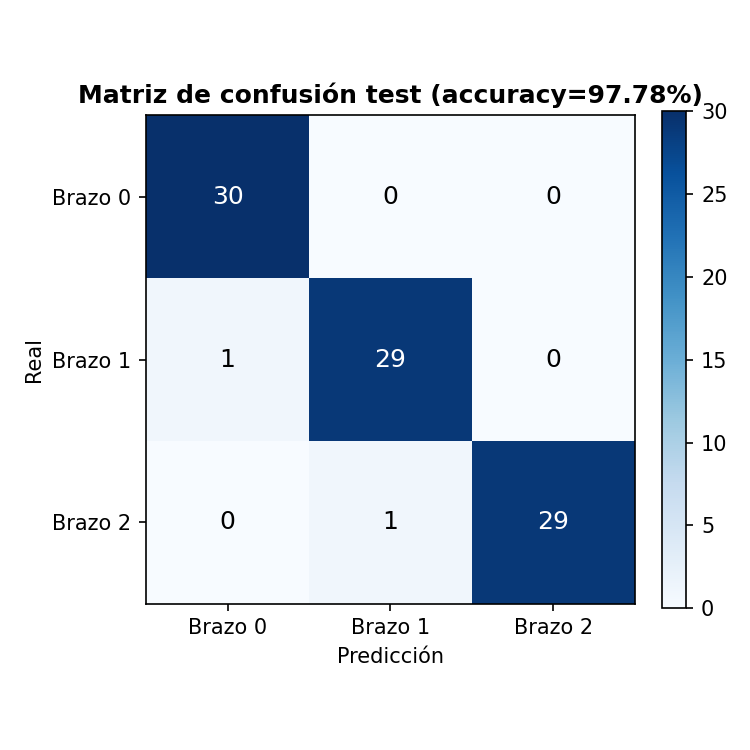
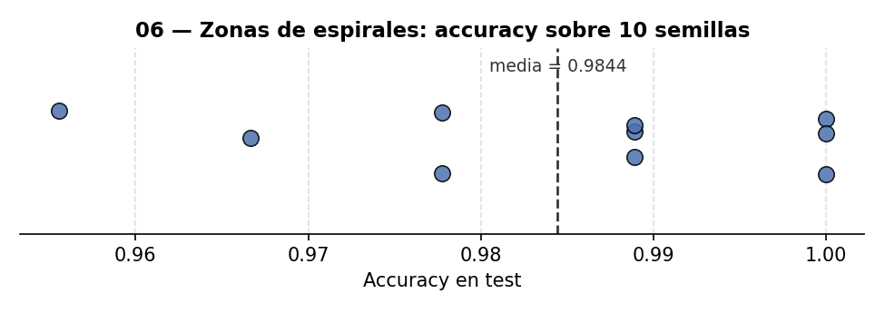
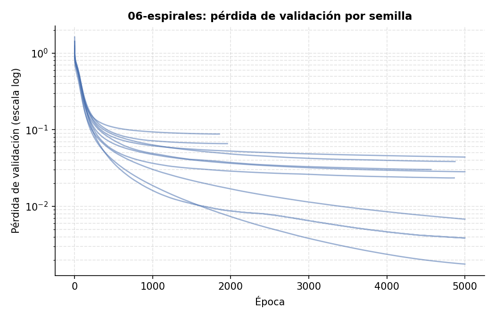
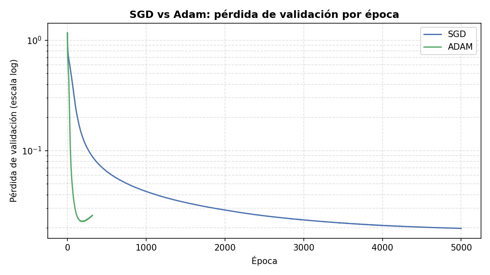
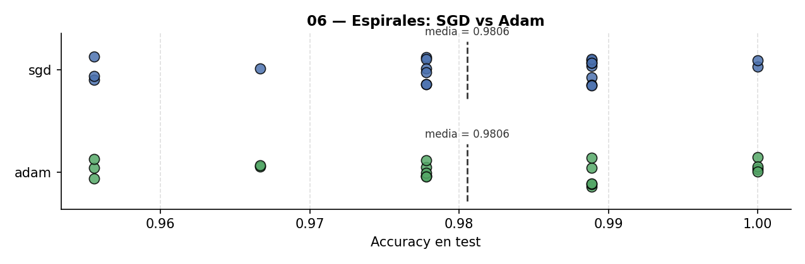
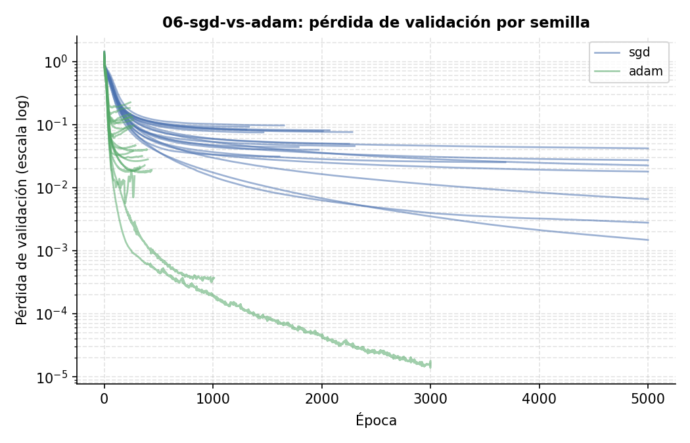

# 06 — Zonas de espirales: frontera de decisión curva

El benchmark clásico para demostrar que una red con capas ocultas puede aprender fronteras de
decisión **curvas**, no solo rectas — 3 brazos de una espiral entrelazados, que ningún
clasificador lineal podría separar. Red modular profunda: 2 → 64 (LeakyReLU) → 64 (LeakyReLU) →
3 (Softmax) — una arquitectura generosa para este problema, no una necesaria: más abajo se
compara contra una sola capa oculta de 8 neuronas, que iguala o supera el resultado.

El generador del dataset (`r`/`theta` con ruido gaussiano) está adaptado del ["minimal neural
network case study" de CS231n](https://cs231n.github.io/neural-networks-case-study/) (Stanford),
material del curso escrito por Andrej Karpathy — la red, el entrenamiento, el split y todo lo
demás de este proyecto son propios.

## Validación y early stopping: un hallazgo metodológico

Con solo train/test (80%/20%) y esta red de ~9k parámetros, el problema sobreajusta a partir
de cierto punto del entrenamiento: el error sobre el conjunto de test deja de bajar y empieza a
subir mientras el de train sigue cayendo, la señal clásica de que la red memoriza en vez de
generalizar. Sin un tercer conjunto separado no hay forma legítima de detectar ese punto de
corte -- pararía mirando el propio test, y luego reportar la accuracy de ese mismo test sería
hacer trampa. La solución es un split en TRES partes -- 60% train / 20% validación / 20% test,
estratificado por brazo -- con early stopping que decide cuándo parar mirando el error de
VALIDACIÓN, nunca el de test.

Hechos verificados en esta ejecución (`seed_split=0, seed_modelo=0`, split 60/20/20): el error
de **test** alcanza su mínimo en la época 1304 (0.0536) y sube hasta 0.0791 al terminar las
5000 épocas -- el sobreajuste es real. El error de **validación**, en cambio, sigue bajando de
forma monótona durante las 5000 épocas completas (su mínimo cae en la época 5000, la última) y
nunca llega a detectar ese repunte, por lo que el early stopping no se activa en esta ejecución.

La causa es el tamaño de la muestra: con solo 30 puntos de validación por brazo, la señal es
demasiado ruidosa para detectar de forma fiable un sobreajuste que sí está presente en el
conjunto de test (otros 30 puntos, con su propia varianza). Es una limitación conocida del
early stopping basado en validación -- cuantos menos puntos, menos fiable la estimación de
"cuándo empieza a empeorar" -- no un fallo del mecanismo: la validación sigue siendo la única
señal legítima para decidir cuándo parar sin tocar el test, simplemente en esta ejecución
concreta no alcanza a capturar el sobreajuste dentro del presupuesto de 5000 épocas.

Esto no compromete la accuracy reportada: el test nunca participó en ninguna decisión de
entrenamiento. El checkpoint de mejor validación (restaura los pesos de la época con menor
`loss_val`, ver [README raíz](../README.md)) recupera aquí los pesos de la época 5000 -- el
final, así que en esta ejecución no cambia el resultado, pero es el mismo mecanismo que sí lo
habría corregido si la validación hubiera detectado el repunte a tiempo.

## Resultado

**Accuracy en test: 97.78%** (90 puntos de test, de 450 en total: 270 train / 90 val / 90
test). Entrenamiento hasta el techo de 5000 épocas configurado (un límite de seguridad, no un
objetivo a alcanzar) -- ver arriba por qué la validación no cortó antes.



**Visualización de datos — zonas aprendidas**: el fondo de color muestra la frontera curva que
la red dibujó para separar los 3 brazos. Los puntos pequeños son entrenamiento, los triángulos
son validación (deciden cuándo parar, nunca entran en el gradiente) y las estrellas grandes son
test.


**Matriz de confusión (test)**: 88 aciertos de 90, solo 2 errores, ambos entre brazos
consecutivos (Brazo 1→Brazo 0 y Brazo 2→Brazo 1) — nunca entre el Brazo 0 y el Brazo 2, que
son los más alejados entre sí en la espiral. Mirando el gráfico de zonas de arriba, tiene
sentido: los 3 brazos se enroscan hacia un centro común, así que cerca del origen (donde las
3 espirales pasan muy cerca unas de otras) es donde la frontera de decisión tiene que curvarse
más y con menos margen, y es justo ahí donde caen los 2 puntos de test mal clasificados. Lejos
del centro, donde los brazos están claramente separados, no hay ningún error.



## ¿Hacía falta una red tan grande?

La arquitectura del proyecto (2 → 64 → 64 → 3, ~9k parámetros) es deliberadamente generosa: el
objetivo es mostrar cómo se encadenan varias capas ocultas (dos pasadas forward/backward, no
una), no encontrar la red más pequeña posible para este problema. Con el mismo split, semilla y
metodología (early stopping + checkpoint sobre validación), una red mucho más pequeña -- una
sola capa oculta de 8 neuronas, **51 parámetros** frente a los ~9k de la versión profunda --
alcanza:

| Arquitectura | Parámetros | Accuracy en test |
|---|---|---|
| 2 → 64 → 64 → 3 (profunda, la del proyecto) | ~9.000 | 97.78% (88/90) |
| 2 → 8 → 3 (una sola capa oculta) | 51 | **98.89% (89/90)** |

La red pequeña no solo iguala, sino que sale un punto por delante -- aunque con un test de solo
90 puntos esa diferencia es literalmente 1 imagen (89/90 frente a 88/90), así que no hay que
leerla como "la red pequeña es mejor" en un sentido estadístico fuerte, sino como evidencia de
que **este problema concreto no necesita tanta capacidad**: 3 brazos de espiral con ruido
moderado es una frontera de decisión curva, pero no especialmente compleja, y 8 neuronas en una
capa ya bastan para separarla bien. La arquitectura profunda de este proyecto es una elección
pedagógica (demostrar el patrón de varias capas encadenadas), no una respuesta a que el
problema lo exigiera.

## Robustez frente a la semilla

Repitiendo el entrenamiento con **20 pares (seed_split, seed_modelo) sorteados de forma
independiente** (`python run_seed_sweep.py --solo 06-espirales --n 20`, ver
[README raíz](../README.md)):

| Métrica | Media | Desv. típica | Mínimo | Máximo | N semillas |
|---|---|---|---|---|---|
| Accuracy en test | 98.06% | 1.34% | 95.56% | 100% | 20 |





La ejecución canónica documentada arriba (97.78%) está cerca de la media, no en un extremo —
resultado estable, coherente con que 3 brazos de espiral con ruido moderado no es un problema
especialmente difícil para esta arquitectura (ver también la comparación con la red pequeña de
más abajo).

## SGD vs Adam: ¿cambiaría mucho el pipeline?

Todo el repo entrena con descenso de gradiente puro (`W -= learning_rate * dW`, ver
`OptimizadorSGD` en [`capas.py`](../capas.py)). Adam ([Kingma & Ba,
2015](https://arxiv.org/abs/1412.6980)) es el optimizador por defecto en la práctica moderna:
lleva una media móvil del gradiente (momento, primer orden) y del gradiente al cuadrado
(segundo orden) por parámetro, para adaptar el tamaño de paso en vez de usar uno fijo para
toda la red. Se implementó desde cero como `OptimizadorAdam` en `capas.py` (mismo espíritu que
el resto del repo: sin `tf.keras.optimizers.Adam`, la fórmula escrita a mano) y se comparó
contra SGD en este proyecto en [`sgd_vs_adam.py`](sgd_vs_adam.py) — **no en
`spiral_classifier.py`**, que se deja intacto: sus resultados (97.78%, el hallazgo de
validación de la sección anterior) siguen siendo los del proyecto canónico. La comparación
reutiliza su misma generación de datos y split (`generar_datos`, `split_estratificado`) pero
guarda sus propios resultados en `results_sgd_vs_adam/` para no mezclarlos.

**Metodología**: misma arquitectura (2→64→64→3), mismo split, y los **mismos pesos iniciales**
en las dos variantes (mismo `seed_modelo`) — la única diferencia es el optimizador de cada capa
y su `learning_rate` propio. Adam necesita uno mucho más pequeño que SGD (aquí 0.01 frente a
0.2): sus pasos ya vienen normalizados por la varianza del gradiente, así que reutilizar el
0.2 de SGD haría oscilar el entrenamiento en vez de converger.

**Resultado de la ejecución canónica** (`seed_split=0, seed_modelo=0`):

| Optimizador | Accuracy en test | Época del mínimo de validación | Época de corte (early stopping) |
|---|---|---|---|
| SGD (lr=0.2) | 97.78% | 5000 (no llegó a activar el early stopping) | 5000 |
| Adam (lr=0.01) | 97.78% | **191** | 319 |

Misma accuracy final, pero Adam encuentra su mejor punto de validación **26 veces más rápido**
(época 191 frente a 5000) — SGD todavía estaba mejorando lentamente cuando se acabaron las 5000
épocas configuradas, mientras que Adam ya había convergido y empezaba a estabilizarse.



**Robustez frente a la semilla (20 semillas por variante,**
`python run_seed_sweep.py --solo 06-sgd-vs-adam --n 20`**)**: el patrón se sostiene en las 20
repeticiones, no es un golpe de suerte de una sola semilla.

| Optimizador | Accuracy media | Desv. típica | Mínimo | Máximo |
|---|---|---|---|---|
| SGD | 98.06% | 1.34% | 95.56% | 100% |
| Adam | 98.06% | 1.48% | 95.56% | 100% |



Las distribuciones de accuracy son prácticamente idénticas (misma media exacta, desviaciones
típicas comparables) — Adam no saca mejor resultado *final* en este problema. Donde sí se nota,
en las 20 semillas, es en la velocidad: superponiendo la pérdida de validación de las 20
repeticiones de cada variante, todas las curvas de Adam (verde) bajan de 10⁻² a 10⁻⁴-10⁻⁵ y se
estabilizan mucho antes de la época 3000, mientras que ninguna curva de SGD (azul) baja de
10⁻² dentro de las 5000 épocas configuradas:



**Conclusión**: para este problema concreto (3 brazos de espiral, red pequeña, ~450 puntos),
Adam no cambia el resultado final — 3 brazos de espiral con ruido moderado ya convergen bien
con SGD dado presupuesto suficiente de épocas, como muestra la comparación de arquitecturas de
la sección anterior. Lo que cambia es el **coste de entrenar**: para llegar al mismo punto,
Adam necesita un orden de magnitud menos de épocas. En problemas más grandes (más parámetros,
más datos, mini-batches con gradiente ruidoso — los casos de 07 y 08), esa diferencia de
velocidad de convergencia suele ser mucho más decisiva que aquí, porque entrenar con SGD hasta
un punto comparable dejaría de ser barato.

Datos crudos: [`results_sgd_vs_adam/metrics.json`](results_sgd_vs_adam/metrics.json) (ejecución
canónica, con matrices de confusión y zonas aprendidas por variante en la misma carpeta) y
[`results_sgd_vs_adam/metrics_seed_sweep.json`](results_sgd_vs_adam/metrics_seed_sweep.json)
(las 20 repeticiones).

## Reproducir

```bash
pip install -r ../requirements.txt
python spiral_classifier.py
python sgd_vs_adam.py          # comparación SGD vs Adam
```
