# 07 — Reconocimiento de dígitos manuscritos (MNIST), 100% NumPy

El proyecto más avanzado del conjunto: reconoce dígitos manuscritos (0-9) del dataset MNIST
con una red neuronal escrita **completamente desde cero en NumPy** — sin TensorFlow, sin
Keras, sin PyTorch. Red modular 784 → 128 (LeakyReLU) → 10 (Softmax), usando el mismo
mini-framework de [`../capas.py`](../capas.py) que el resto de proyectos de este repo.

Split en tres partes estratificado por dígito -- train / validación / test -- con early
stopping que decide cuándo parar mirando el error de VALIDACIÓN, nunca el de test. El test se
toca una única vez, al final, con la red ya congelada, para reportar una accuracy y una matriz
de confusión honestas sobre dígitos nunca vistos en el entrenamiento.

## 1. Entrenamiento — `digit_classifier.py`

Entrena la red sobre 1200 imágenes (120 por dígito), valida sobre 300 (30 por dígito, deciden
el early stopping) y evalúa sobre otras 300 de test (30 por dígito, nunca vistas hasta la
evaluación final). Guarda los pesos entrenados en `results/red_pesos.npz` para que la demo
interactiva no tenga que reentrenar.

**Resultado**: **89.00% accuracy en test**. El early stopping corta en la época 695 de las 800
configuradas (techo de seguridad, no un objetivo), pero los pesos usados para evaluar son los
de la época 633 -- el mínimo real de `loss_val`, restaurado por checkpoint (ver "Checkpoint del
mejor punto de validación" en el [README raíz](../README.md); el early stopping necesita ver
200 épocas sin mejora para confirmar el corte, así que el punto en que corta siempre queda por
detrás del mínimo real). Con una red minúscula (784→128→10, ~101k parámetros) entrenada sobre
solo 1200 imágenes y sin ningún tipo de aumento de datos ni regularización. Antes, sin
validación, la red entrenaba las 800 épocas completas y llegaba a 91.67% en test, pero ese
número no era comparable con nada: no había forma honesta de saber si a la época 800 la red ya
estaba sobreajustando, porque el propio test se usaba de facto como referencia implícita para
fijar `epochs=800`. El 89.00% actual es más bajo pero es la cifra en la que se puede confiar,
porque la decisión de parar la tomó la validación sin haber mirado nunca el test.

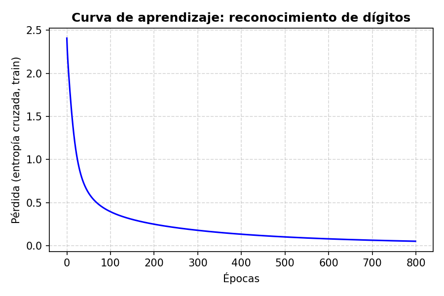

**Visualización de datos** — muestra del dataset de entrenamiento:

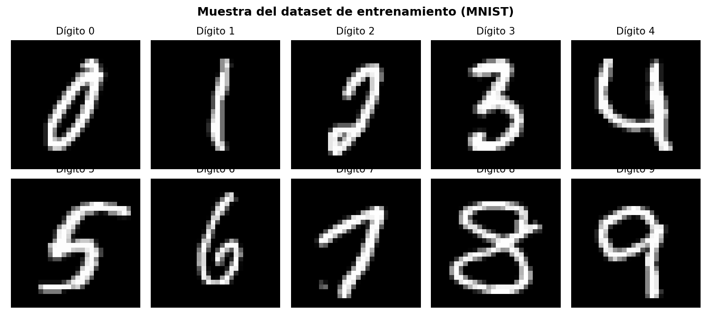

**Matriz de confusión (test)**:

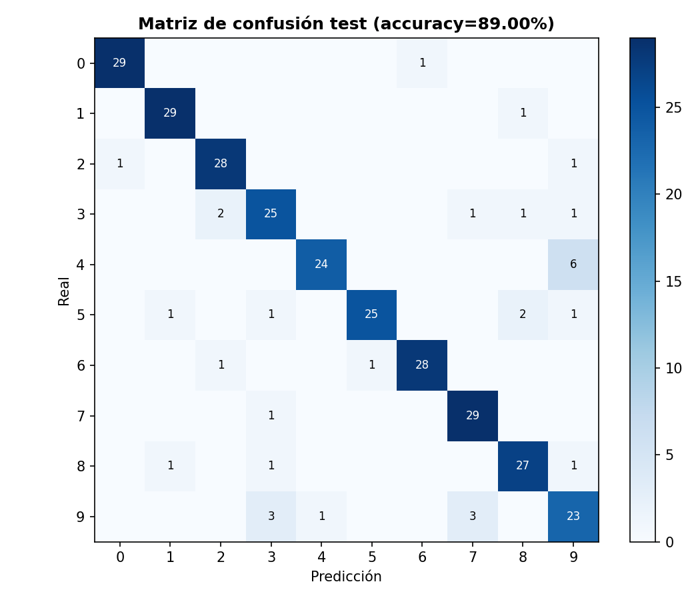

**Lectura de la matriz**: la diagonal domina (267 de 300 aciertos) y la mayoría de errores son
casos sueltos, lo esperable con solo 1200 imágenes de entrenamiento, sin aumento de datos y
parando el entrenamiento en cuanto la validación deja de mejorar. Dos patrones destacan:

- **"9" es el dígito más difícil** (23/30 = 76.7%, el peor de los 10): se confunde sobre todo
  con "3" (3 casos) y "7" (3 casos). Tiene sentido en trazos manuscritos donde el lazo superior
  del 9 queda poco cerrado o el trazo vertical se confunde con el travesaño del 7.
- **"4"→"9" es la confusión individual más repetida (6 de 30 cuatros)**: un "4" con el trazo
  superior cerrado o desplazado se parece mucho a un "9" en letra manuscrita — la red pequeña,
  entrenada con pocos datos y parada pronto por el early stopping, no llega a aprender el
  detalle fino (el ángulo abierto del 4 frente al lazo cerrado del 9) que distingue ambos casos.

Con una red más grande, más datos o aumento de datos (rotaciones/desplazamientos pequeños)
estos casos límite mejorarían.

## 2. Dataset completo + mini-batches — `digit_classifier_full.py`

`digit_classifier.py` usa full-batch: una única actualización de pesos por época, sobre toda la
muestra de golpe. Es manejable con 1.200 imágenes, pero no escala -- con las 70.000 imágenes
completas de MNIST, seguir haciendo full-batch significaría 1 sola actualización de pesos por
época sobre una matriz enorme. `digit_classifier_full.py` es la misma red y la misma
metodología (split 60/20/20, early stopping por validación, checkpoint del mejor punto),
entrenada en cambio por **mini-batches de 32 imágenes** (~1.313 actualizaciones de pesos por
época) sobre el dataset **completo**, estratificado 60/20/20 por dígito usando las 70.000
imágenes reales de MNIST (no perfectamente equilibrado entre dígitos: entre 6.313 y 7.877
imágenes según el dígito).

Detalle importante al convertir full-batch en mini-batch: el gradiente de la capa de salida se
normaliza por el tamaño del **batch actual** (`Yb.shape[0]`), no por el tamaño de todo el
conjunto de train — dejar el denominador del full-batch original es un error clásico y
silencioso (ningún except salta, el entrenamiento simplemente converge mal o absurdamente
despacio).

| | Train | Val | Test | Accuracy test |
|---|---|---|---|---|
| Muestra reducida, full-batch (`digit_classifier.py`) | 1.200 | 300 | 300 | 89.00% |
| Dataset completo, mini-batch (`digit_classifier_full.py`) | 41.995 | 13.996 | 14.009 | **97.46%** |

La mejora (+8.5 puntos) confirma que el límite real de la versión reducida no era la
arquitectura (784→128→10 sigue siendo la misma red en ambos casos) sino la combinación de poca
muestra y una sola actualización de pesos por época. Con mini-batches, la red converge además
en muchísimas menos épocas: early stopping en la época 19 (de 30 configuradas), con los pesos
restaurados de la época 15 — frente a las 695 épocas (de 800) que necesitaba la versión
full-batch, porque cada "época" aquí ya contiene ~1.313 pasos de descenso de gradiente en vez
de 1.

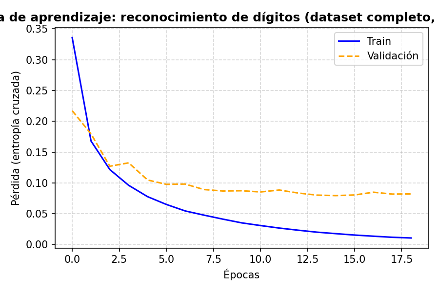

**Matriz de confusión (test, dataset completo)**:

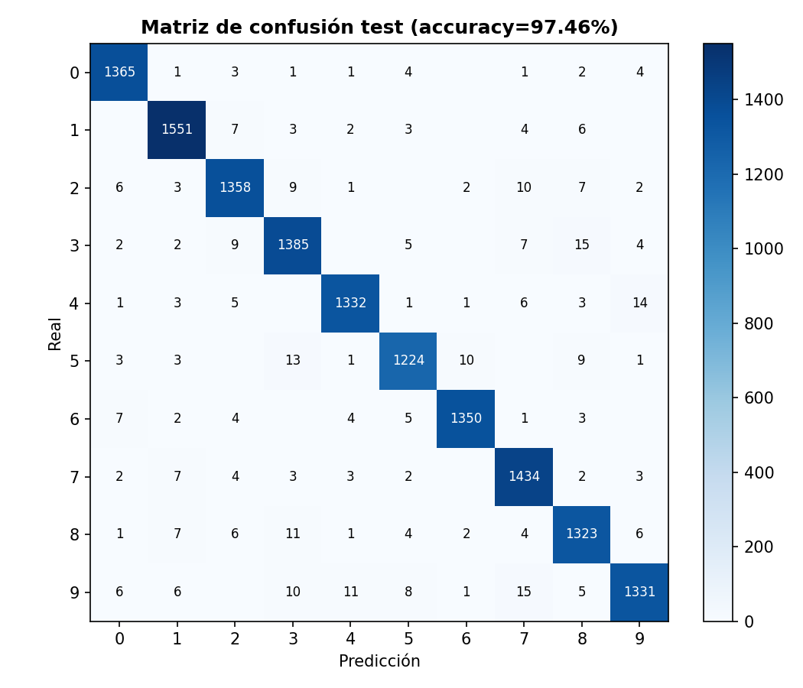

**Lectura**: con 14.009 imágenes de test, la diagonal domina de forma mucho más uniforme que en
la versión reducida — el peor dígito pasa de 76.7% (el "9" en la muestra pequeña) a **95.6%**
(sigue siendo el "9" el más difícil, pero ahora seguido de cerca por "5" al 96.8% y "8" al
97.0%, no un salto brusco). La confusión "4"→"9" que era la más repetida en la versión
reducida (6 de 30 cuatros, 20%) sigue presente en términos absolutos (14 de 1.366 cuatros), pero
ahora es solo un 1.0% de los cuatros de test — el mismo patrón de confusión real (rasgos
compartidos entre 4 y 9 mal trazados) sigue ahí, simplemente con muchos menos casos porque la
red tiene mucha más muestra de la que aprender el detalle fino que los distingue.

## 3. Demo interactiva — `demo_gradio.py`

Carga los pesos ya entrenados (de `digit_classifier.py`, la versión reducida) y abre un
Sketchpad donde se puede dibujar un dígito a mano para clasificarlo en vivo. Reutiliza el mismo
preprocesado de centrado por centro de masa (caja 20x20 dentro de un lienzo 28x28) que replica
cómo está construido MNIST realmente — sin ese centrado, un trazo dibujado a mano y simplemente
reescalado queda muy descentrado respecto a los datos de entrenamiento y la precisión cae mucho
aunque la red esté bien entrenada.

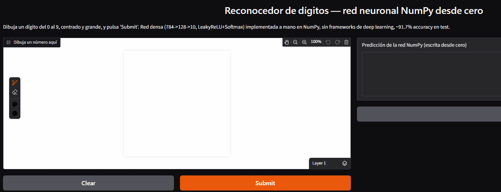

## Robustez frente a la semilla

Repitiendo cada variante con **20 pares (seed_split, seed_modelo) sorteados de forma
independiente** (`python run_seed_sweep.py --solo 07-digitos-fullbatch --n 20` /
`--solo 07-digitos-minibatch --n 20`, ver [README raíz](../README.md)):

| Variante | Accuracy media ± desv. típica | Rango (20 semillas) |
|---|---|---|
| Muestra reducida, full-batch | 88.23% ± 1.76% | 83.33%–90.67% |
| Dataset completo, mini-batch | 97.46% ± 0.24% | 96.71%–97.80% |

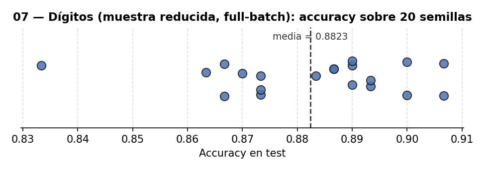

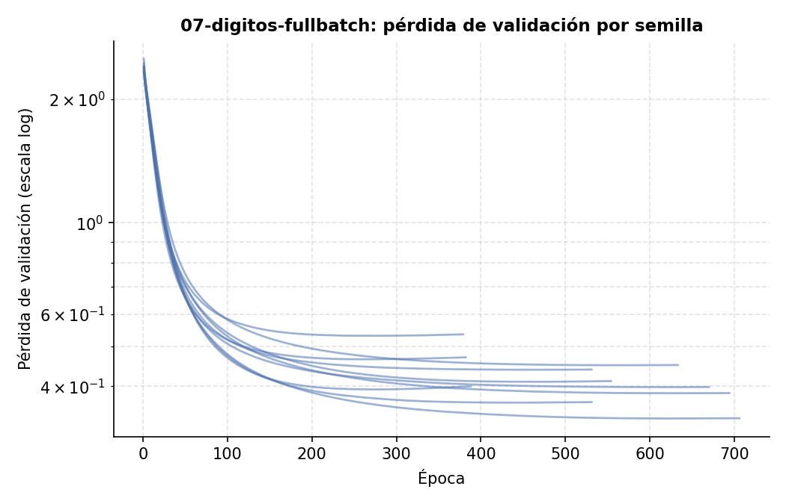

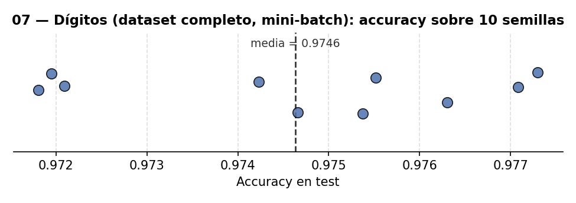

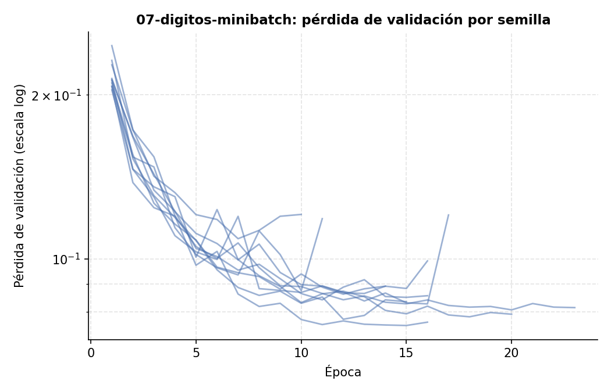

La versión reducida (1.200 imágenes) tiene ~7 veces más varianza entre semillas que la del
dataset completo — coherente con lo esperable: con menos datos, tanto la inicialización como
qué 300 imágenes concretas caen en test pesan proporcionalmente más en el resultado final. La
comparación de la sección 2 (+8.5 puntos a favor del dataset completo) es robusta a la semilla:
incluso en su peor caso (83.33%), la versión reducida sigue muy por debajo del peor caso de la
versión completa (96.71%) — los rangos ni siquiera se solapan.

## SGD vs Adam

Mismo experimento que en [`06-zonas-espirales`](../06-zonas-espirales/) (ver su README para la
explicación completa de por qué Adam necesita su propio learning_rate), aquí en las dos escalas
de este proyecto. `sgd_vs_adam.py` (full-batch) y `sgd_vs_adam_full.py` (mini-batch) no tocan
`digit_classifier.py`/`digit_classifier_full.py` -- reutilizan su `cargar_datos()` y guardan sus
propios resultados en `results_sgd_vs_adam/` / `results_full_sgd_vs_adam/`.

**Ejecución canónica** (`seed_split=42, seed_modelo=42`):

| Variante | Optimizador | Accuracy test | Época del mínimo de validación |
|---|---|---|---|
| Full-batch | SGD (lr=0.1) | 89.00% | 633 |
| Full-batch | Adam (lr=0.001) | **90.67%** | **119** |
| Mini-batch | SGD (lr=0.1) | **97.46%** | 15 |
| Mini-batch | Adam (lr=0.001) | 97.34% | **9** |

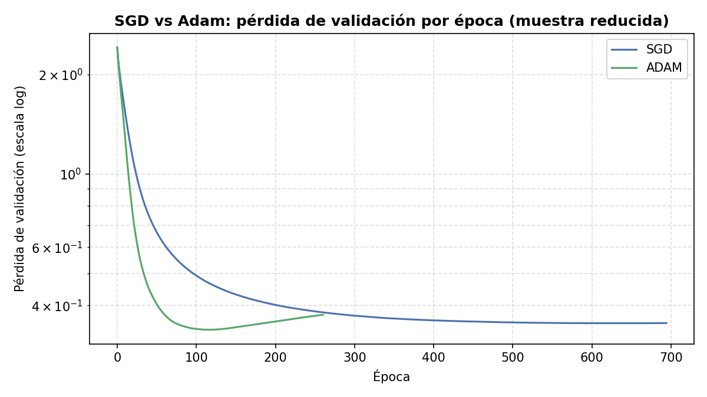

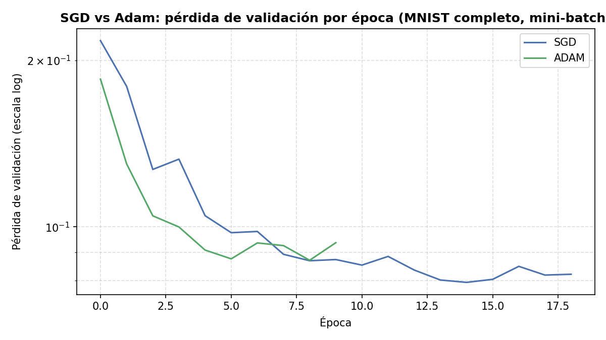

**Robustez frente a la semilla (20 semillas por variante)**:

| Variante | Optimizador | Accuracy media ± desv. típica | Rango |
|---|---|---|---|
| Full-batch | SGD | 88.23% ± 1.76% | 83.33%–90.67% |
| Full-batch | Adam | 88.15% ± 1.69% | 84.33%–92.00% |
| Mini-batch | SGD | 97.46% ± 0.24% | 96.71%–97.80% |
| Mini-batch | Adam | 97.31% ± 0.12% | 97.07%–97.50% |

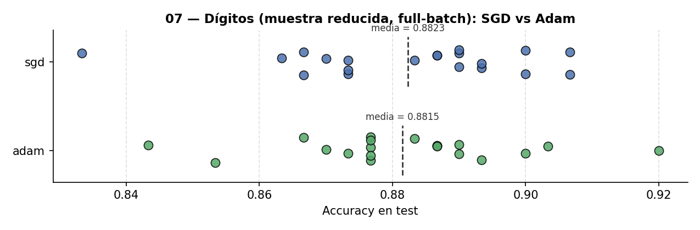

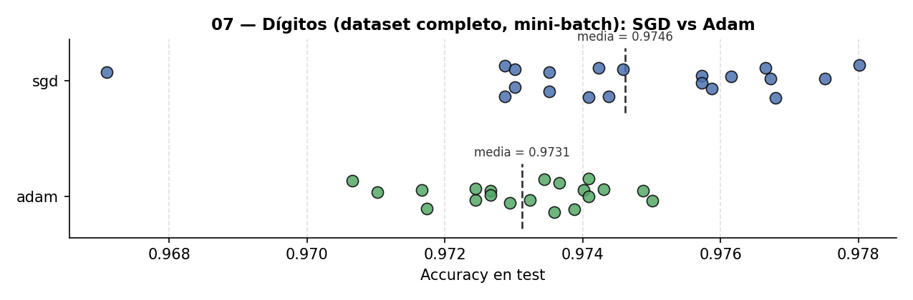

**Lectura honesta, distinta de la de 06**: en la ejecución canónica full-batch Adam parecía
ganar accuracy (+1.67 puntos) además de converger 5.3 veces más rápido (época 119 frente a
633) -- pero con 20 semillas esa ventaja de accuracy desaparece (88.15% vs 88.23%, dentro del
ruido de una semilla a otra): la ganancia de la ejecución canónica era en buena parte suerte de
esa semilla concreta, no un efecto sistemático. Lo que sí se sostiene en las 20 semillas es la
velocidad de convergencia, visible en la superposición de curvas
(`results_sgd_vs_adam/seed_sweep_curvas.png` /
`results_full_sgd_vs_adam/seed_sweep_curvas.png`): Adam llega a su mínimo de validación en una
fracción de las épocas que necesita SGD, con una accuracy final estadísticamente indistinguible
(full-batch) o incluso ligeramente por debajo pero más consistente -- menor desviación típica,
0.12 frente a 0.24 -- en mini-batch. Con ~1.312 actualizaciones de pesos por época, el mini-batch
ya converge rápido por sí solo (19 épocas en SGD), así que la ventaja de velocidad de Adam es
menor en términos relativos que en full-batch (una sola actualización por época).

## Esquema B: split fijo vs split libre

Pregunta distinta a la de "Robustez frente a la semilla": ahí `seed_split` y `seed_modelo`
varían los dos, cada uno de forma independiente ("split libre"). Aquí `seed_split` se deja
**fijo en 42 siempre** y solo `seed_modelo` varía en las 20 repeticiones ("split fijo") --
aísla cuánto de la varianza observada viene solo de reinicializar los pesos, con exactamente
la misma partición train/val/test todas las veces. No hay `SEED_DATOS` en este proyecto (MNIST
es un dataset real, no generado), así que fijar el split es el equivalente más cercano a "fijar
los datos" que existe aquí. Se ejecuta con
[`run_seed_sweep_esquemaB.py`](../run_seed_sweep_esquemaB.py) (ver su docstring para el porqué
completo), reutilizando el mismo `sgd_vs_adam.py`/`sgd_vs_adam_full.py` -- solo cambian las
semillas con las que se le llama.

| Variante | Split libre (media ± std) | Split fijo (media ± std) |
|---|---|---|
| Full-batch, SGD | 88.23% ± 1.76% | 89.55% ± 0.47% |
| Full-batch, Adam | 88.15% ± 1.69% | 90.23% ± 0.61% |
| Mini-batch, SGD | 97.46% ± 0.24% | 97.43% ± 0.11% |
| Mini-batch, Adam | 97.31% ± 0.12% | 97.28% ± 0.11% |

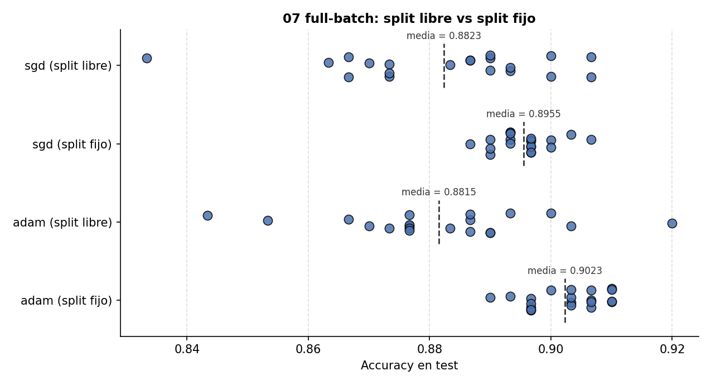

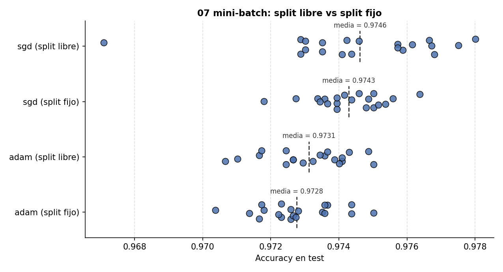

**Lectura**: en las dos variantes, fijar el split reduce la desviación típica de forma clara
(en full-batch, a una cuarta parte aprox.) -- tiene sentido, se elimina una fuente entera de
varianza. Pero en full-batch la media también **sube** casi 2 puntos respecto al split libre
(88-88% → 89-90%): la partición `seed_split=42` en concreto resulta ser algo más fácil que la
media de particiones aleatorias sobre solo 1.200 imágenes -- con tan poca muestra, qué imágenes
concretas caen en test todavía pesa. En mini-batch (42.000 imágenes) la media prácticamente no
se mueve (97.46→97.43, 97.31→97.28): con mucha más muestra, una partición concreta ya no es
distinguible de otra. Es el mismo patrón que "Robustez frente a la semilla" ya mostraba (más
varianza en la muestra reducida que en el dataset completo), visto ahora desde el ángulo
contrario: split fijo no es gratis -- cambia la desviación típica, pero también puede sesgar la
media si la partición fija elegida no es representativa, sobre todo con poca muestra.

## Learning rate decay

Sobre la configuración de referencia (Adam, mini-batch, split libre -- ver README raíz para
por qué esta es la base para todo lo nuevo del repo, en vez de repetir la comparación
SGD-vs-Adam otra vez): `lr(época) = 0.001 · 0.9^época`, decaimiento exponencial, frente al
mismo Adam con `learning_rate` constante. Reutiliza `crear_red()` de `sgd_vs_adam_full.py` sin
tocarlo -- [`lr_decay.py`](lr_decay.py).

| Variante | Accuracy test | Época del mínimo | Loss val. mínimo |
|---|---|---|---|
| Adam, lr constante | 97.34% | 9 | 0.0870 |
| Adam, lr con decay | **97.49%** | 11 | **0.0824** |

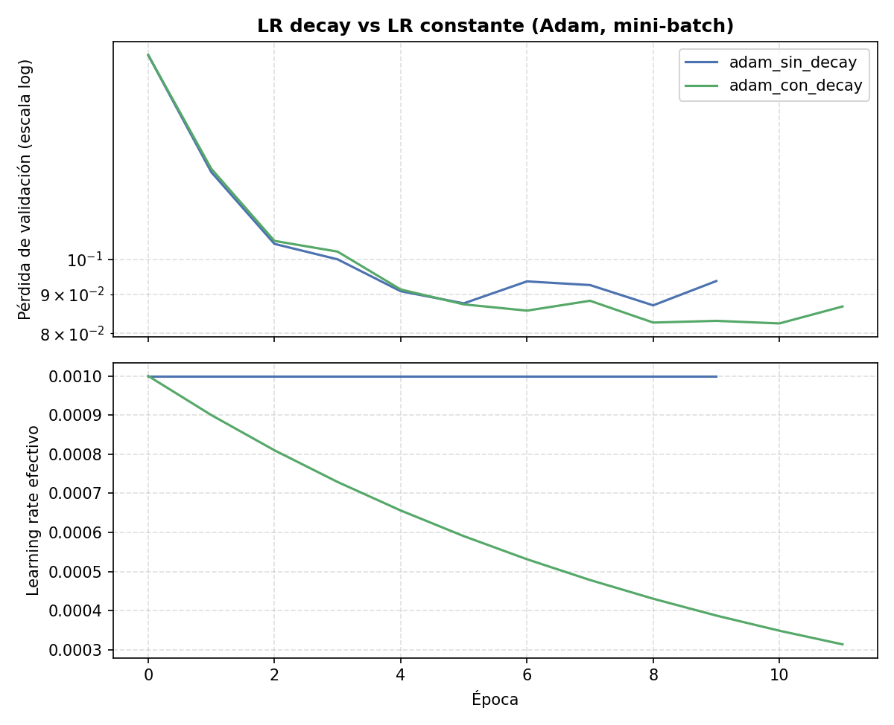

Mejora pequeña pero real (+0.15 puntos, loss de validación algo mejor) a cambio de 2 épocas
más -- con el learning_rate constante, la pérdida de validación empieza a oscilar hacia el
final (curva azul, últimas 3 épocas); con decay se amortigua esa oscilación porque el paso se
hace más pequeño justo cuando el entrenamiento ya está cerca del mínimo. Datos crudos,
incluida la curva de `learning_rate` real usada en cada época, en
[`results_lr_decay/metrics.json`](results_lr_decay/metrics.json).

## BatchNorm

`CapaBatchNorm` (nueva, en [`../capas.py`](../capas.py)) normaliza cada característica a media
0 / varianza 1 sobre el batch actual y aplica una escala/desplazamiento aprendidos (gamma,
beta) -- verificada por diferencias finitas en
[`../tests/test_gradients.py`](../tests/test_gradients.py), igual que el resto de capas.
Insertada entre la capa oculta y su activación (Dense → BatchNorm → LeakyReLU), sobre la
configuración de referencia -- [`batchnorm.py`](batchnorm.py), no toca
`sgd_vs_adam_full.py`.

| Variante | Accuracy test | Época del mínimo | Loss val. mínimo |
|---|---|---|---|
| Adam, sin BatchNorm | **97.34%** | 9 | 0.0870 |
| Adam, con BatchNorm | 96.65% | 10 | **0.0806** |

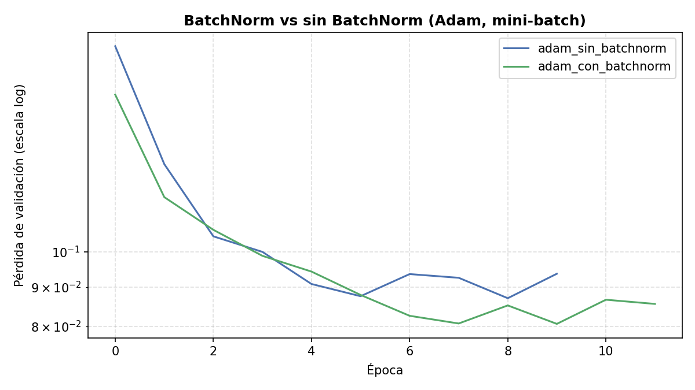

**Resultado que merece explicarse, no maquillarse**: con BatchNorm la pérdida de validación
mínima es mejor (0.0806 frente a 0.0870), pero la accuracy en test es peor (96.65% frente a
97.34%) -- loss y accuracy no siempre se mueven juntos. Son dos formas distintas de medir el
error: la pérdida (entropía cruzada) penaliza por lo segura que está la red incluso cuando
acierta la clase, mientras que accuracy solo mira si la clase más probable es la correcta. Es
posible que BatchNorm produzca predicciones con probabilidades mejor calibradas en conjunto
(loss más bajo) sin que eso cambie a favor cuántas veces exactamente acierta la clase top-1 en
esta red concreta -- 128 neuronas en la capa oculta es poco margen para que BatchNorm aporte lo
que suele aportar en redes bastante más profundas (que es donde se diseñó y donde de verdad
hace falta estabilizar la distribución de activaciones capa a capa). No se ha intentado ajustar
hiperparámetros para forzar un resultado más favorable.

## FGSM: el gradiente que se descartaba, usado a propósito

`CapaDensa.backward()` calcula, en cada capa, el gradiente de la pérdida respecto a **su
entrada** (`dX_anterior`) -- necesario para propagarlo hacia atrás. En la primera capa de la
red, ese gradiente es el gradiente respecto a los **píxeles de la imagen**, y hasta ahora se
descartaba (no hay ninguna capa antes a la que pasárselo). FGSM (Fast Gradient Sign Method,
[Goodfellow et al.,
2015](https://arxiv.org/abs/1412.6572)) es exactamente ese gradiente, capturado y usado a
propósito: en vez de mover los pesos en la dirección que reduce el error (entrenamiento
normal), mueve los **píxeles** en la dirección que más lo **aumenta** --
`X_adv = clip(X + ε · signo(dL/dX), 0, 1)`. Sobre la red de referencia (Adam, mini-batch) ya
entrenada -- [`fgsm.py`](fgsm.py), no toca `sgd_vs_adam_full.py`.

| Epsilon | 0.00 | 0.02 | 0.05 | 0.10 | 0.15 | 0.20 | 0.30 |
|---|---|---|---|---|---|---|---|
| Accuracy | 97.34% | 89.37% | 48.20% | 7.30% | 0.63% | 0.01% | 0.00% |

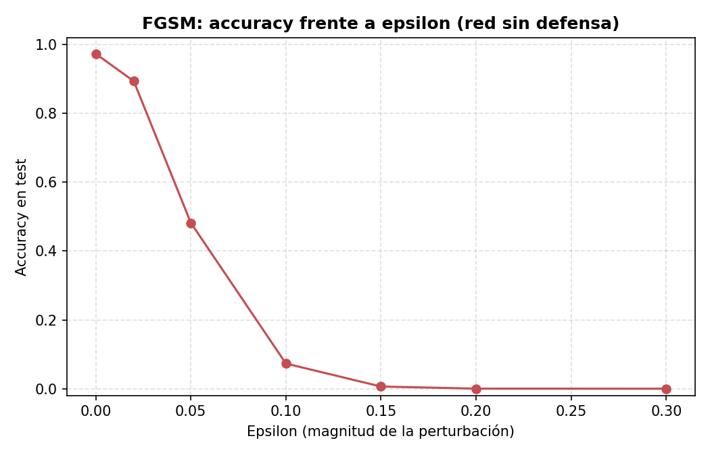

Con una perturbación tan pequeña que apenas se aprecia (ε=0.1, sobre píxeles normalizados a
[0,1]) la accuracy ya se desploma de 97.34% a 7.30% -- peor que adivinar al azar (10% con 10
clases). La red no ha cambiado, los píxeles apenas se han movido, y sigue siendo el mismo
dígito a ojos de una persona:

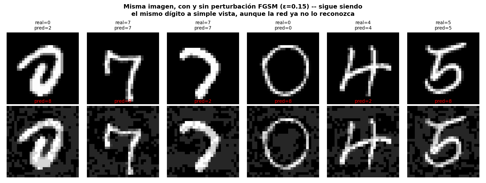

No es un truco académico aislado: es la vulnerabilidad estándar que cualquier modelo de visión
artificial en producción tiene que tener en cuenta antes de confiar en él para una decisión
automática.

## PGD: la versión iterativa de FGSM

FGSM da un único paso grande en la dirección del signo del gradiente. PGD (Projected Gradient
Descent, [Madry et al.,
2017](https://arxiv.org/abs/1706.06083)) da varios pasos pequeños, y tras cada uno **proyecta**
la imagen de vuelta dentro de la bola de radio epsilon alrededor del original -- de ahí el
nombre. Reutiliza `gradiente_respecto_a_entrada()` de `fgsm.py` sin duplicarlo -- 10 pasos,
tamaño de paso `epsilon/4` (regla práctica de Madry et al.) -- [`pgd.py`](pgd.py).

| Epsilon | 0.00 | 0.02 | 0.05 | 0.10 | 0.15 | 0.20 | 0.30 |
|---|---|---|---|---|---|---|---|
| Accuracy (FGSM) | 97.34% | 89.37% | 48.20% | 7.30% | 0.63% | 0.01% | 0.00% |
| Accuracy (PGD) | 97.34% | 88.74% | 41.12% | **3.67%** | **0.14%** | 0.00% | 0.00% |

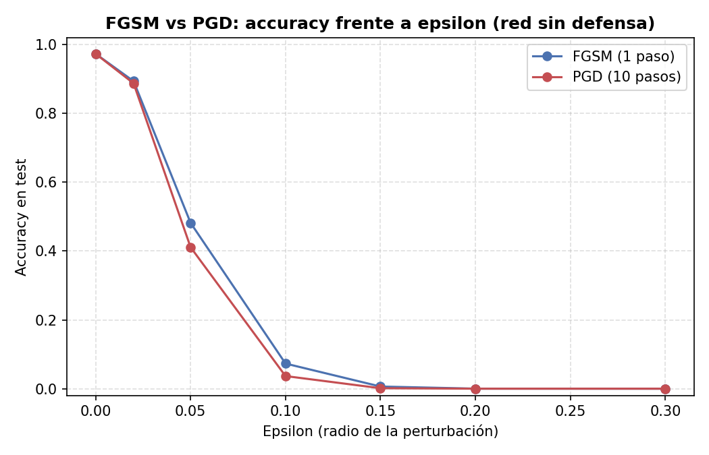

PGD es igual o más dañino que FGSM en todos los epsilon (nunca al revés, como cabía esperar --
más pasos con proyección solo puede explorar mejor la bola de perturbaciones permitidas, no
peor) -- en ε=0.1, casi la mitad de accuracy respecto a FGSM con el mismo presupuesto de
perturbación (3.67% frente a 7.30%). Es la referencia estándar en la literatura para medir
robustez adversaria precisamente porque explota el gradiente de forma más completa que un
único paso.

## Reproducir

```bash
pip install -r ../requirements.txt
python digit_classifier.py        # versión reducida, full-batch (~1-2 min, descarga MNIST la primera vez)
python digit_classifier_full.py   # dataset completo, mini-batch (~pocos minutos, ver README)
python sgd_vs_adam.py             # comparación SGD vs Adam, full-batch
python sgd_vs_adam_full.py        # comparación SGD vs Adam, mini-batch (~1-2 min)
python lr_decay.py                # LR decay vs LR constante (~1 min)
python batchnorm.py               # BatchNorm vs sin BatchNorm (~1 min)
python fgsm.py                    # FGSM: accuracy vs epsilon (~1 min)
python pgd.py                     # PGD: accuracy vs epsilon (~1-2 min)
python demo_gradio.py             # demo interactiva, requiere haber ejecutado antes digit_classifier.py

# Esquema B (split fijo) -- ver ../run_seed_sweep_esquemaB.py
python ../run_seed_sweep_esquemaB.py --solo 07-fullbatch-sgd-vs-adam --n 20
python ../run_seed_sweep_esquemaB.py --solo 07-minibatch-sgd-vs-adam --n 20
```

## Limitaciones

- `digit_classifier.py` usa solo 1.200 imágenes de entrenamiento (frente a las ~42.000
  disponibles con el split completo) precisamente para poder entrenar full-batch en CPU sin
  frameworks optimizados de forma rápida y sencilla de leer — es una limitación intencionada
  para ilustrar el mecanismo con claridad, no un límite real: `digit_classifier_full.py`
  entrena sobre el dataset completo con mini-batches y consigue 97.46% frente al 89.00% de la
  versión reducida (ver sección 2 arriba).
- Sin aumento de datos, regularización (dropout) ni ajuste de hiperparámetros.
