# 08 — CNN sobre Fashion-MNIST, 100% NumPy: baseline vs data augmentation

El proyecto más avanzado del repo: una **CNN completa (convolución + max pooling + dropout)
escrita desde cero en NumPy**, sin TensorFlow, sin Keras, sin PyTorch — ni siquiera para la
parte convolucional. Los 7 proyectos anteriores usan solo capas densas; este añade
convolución 2D, pooling y dropout implementados a mano en
[`capas_cnn.py`](capas_cnn.py) mediante la técnica **im2col** (convertir cada ventana de la
imagen en una fila de una matriz, para que la convolución se resuelva con una sola
multiplicación de matrices en vez de con bucles Python por píxel — lo que hace viable
entrenar la red entera en CPU sin GPU). Los gradientes de `CapaConv2D`, `CapaMaxPool2D` y del
resto de capas de [`../capas.py`](../capas.py) se verifican numéricamente contra diferencias
finitas en [`../tests/test_gradients.py`](../tests/test_gradients.py) — no es una afirmación
sin más, se puede ejecutar y comprobar:

```bash
pip install -r ../requirements.txt
pytest ../tests/test_gradients.py -v
```

La arquitectura se entrena **tres veces con los mismos pesos iniciales**: tal cual (*baseline*),
con data augmentation completa (flip horizontal, rotación, zoom y desplazamiento aleatorios,
reimplementados a mano en NumPy — ver `augmentar_lote()` en `capas_cnn.py`) y con la misma
augmentation pero sin flip (*augmented_sin_flip*, para aislar su efecto), para medir el efecto
real de la técnica en vez de solo mencionarla.

## Arquitectura

```
Entrada 28×28×1
  → Conv2D 3×3, 8 filtros → LeakyReLU → MaxPool 2×2      (26×26×8 → 13×13×8)
  → Conv2D 3×3, 16 filtros → LeakyReLU → MaxPool 2×2     (11×11×16 → 5×5×16)
  → Flatten (400)
  → Densa 400→64 → LeakyReLU → Dropout(0.3)
  → Densa 64→10 → Softmax
```

~27.500 parámetros. Entrenamiento full-batch (mismo estilo que el resto del repo, sin
mini-batches), con split de tres partes estratificado por clase: **2400 imágenes de train**
(240/clase), **600 de validación** (60/clase, decide el early stopping) y **1000 de test**
(100/clase, se evalúan una sola vez, después de entrenar) — mismo patrón de estratificación
que `07-reconocimiento-digitos`, con el split de validación añadido (ver "Metodología" en el
[README raíz](../README.md) para el porqué).

## Los datos y la augmentation

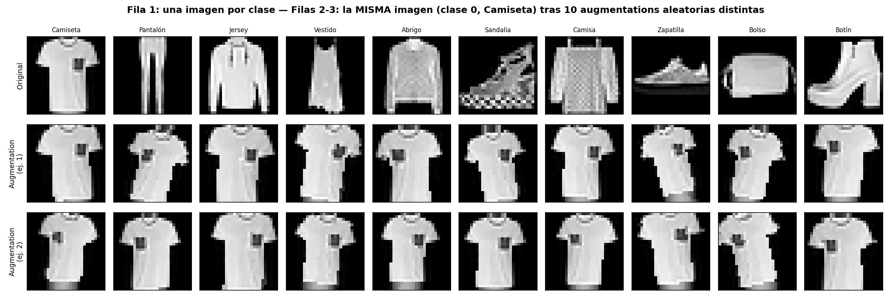

Fila 1: una prenda de cada una de las 10 clases de Fashion-MNIST. Filas 2 y 3: la **misma**
imagen (una camiseta) sometida a 10 augmentations aleatorias distintas cada vez — se ve el
flip horizontal, la rotación, el zoom y el desplazamiento actuando de forma independiente en
cada copia, tal como los vería la red en épocas distintas. La validación y el test **nunca**
pasan por `augmentar_lote()` — es una técnica de entrenamiento, no algo que la red vaya a ver
en producción.

## Resultado: la augmentation sigue por detrás del baseline con este presupuesto de épocas

El early stopping de cada versión decide cuándo parar mirando su propio loss de
**validación** — no hace falta igualar nada a mano entre baseline y augmented, cada una para
sola cuando su validación deja de mejorar. En este presupuesto de 400 épocas máximas (techo de
seguridad, no un objetivo), el **baseline sí activa el early stopping** (época 324); augmented
lo activa casi al final (época 396). Los pesos usados para evaluar son los del mínimo de
`loss_val` de cada una, restaurados por checkpoint (ver "Checkpoint del mejor punto de
validación" en el [README raíz](../README.md)):

| | Épocas (corte) | Época del mínimo de validación | Accuracy en test | Loss validación (mínimo) |
|---|---|---|---|---|
| **Baseline** | 324 | 315 | **79.50%** | 0.5060 |
| **Con augmentation** | 396 | 376 | **76.20%** | 0.6072 |

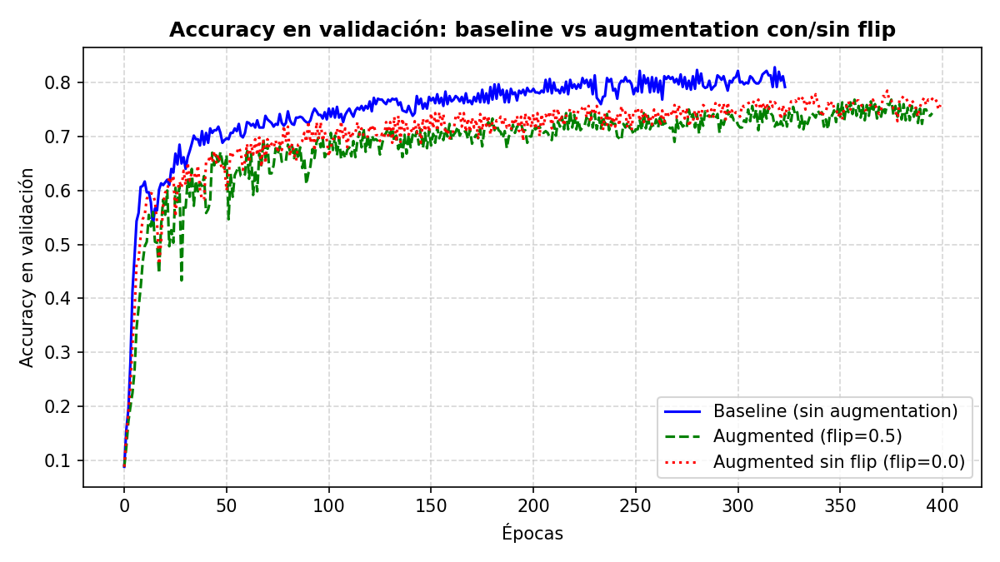

La curva de arriba muestra accuracy de **validación** (lo que efectivamente se registra época
a época; el test es un único número final por versión, calculado una sola vez). La verde
(augmented) no cruza a la azul (baseline) en ningún punto del entrenamiento.

**Por qué tiene sentido, no solo "la augmentation no funcionó"**:

1. **Cada época de augmentation es una época distinta de facto.** El baseline refina el mismo
   dataset de 2400 imágenes una y otra vez; la versión con augmentation ve una transformación
   aleatoria distinta en cada época, así que en la práctica optimiza sobre un objetivo más
   ruidoso y le cuesta más ajustar los pesos por época — se nota en la curva verde, claramente
   más ruidosa que la azul. Con un presupuesto de épocas fijo, ese coste de optimización se
   paga entero pero el beneficio de generalización (que necesita más tiempo para notarse) no
   llega a compensarlo del todo, aunque el checkpoint sí recupera parte de esa diferencia: la
   versión augmented es la que más se beneficia de quedarse con los pesos del mínimo de
   validación (época 370) en vez de los de la época 400, precisamente porque su curva es más
   ruidosa y el punto final no coincide con el mejor punto.
2. **El hueco de overfitting que hay que cerrar es pequeño.** En el mínimo de validación del
   baseline, el loss de train (0.4658) y el de validación (0.5060) están razonablemente cerca
   (ver `results/metrics.json`) — la red ya generaliza decentemente gracias al Dropout(0.3) que
   ambas versiones comparten. La augmentation ayuda más cuando el modelo memoriza (train mucho
   mejor que validación); aquí ese síntoma es moderado, así que añadir encima una augmentation
   agresiva (rotación ±15°, zoom ±10%, desplazamiento ±2px) paga el coste de optimización sin
   un hueco grande que cerrar a cambio.
3. **Fashion-MNIST ya viene centrado y recortado de forma consistente** (a diferencia de fotos
   reales de un catálogo, por ejemplo), así que hay menos variación de pose/posición que
   "enseñar a ignorar" con augmentation geométrica — el margen de mejora que esta técnica
   puede aportar aquí es más pequeño de partida que en un dataset con más variabilidad real.

Este es un resultado conocido en la práctica: con un presupuesto de épocas limitado, la
augmentation puede seguir por detrás del baseline en vez de superarlo, porque añade dificultad
de optimización antes de que el beneficio de generalización llegue a notarse del todo.

## Matrices de confusión: dónde falla cada versión

**Baseline (79.50%)**:

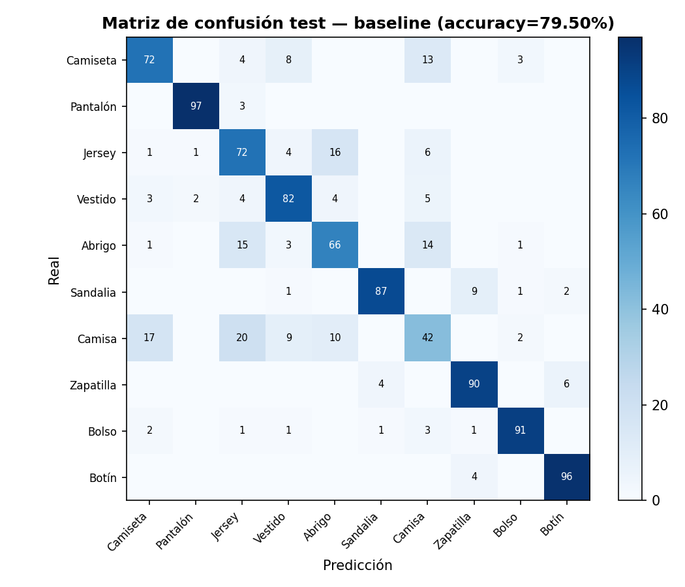

**Con augmentation (76.20%)**:

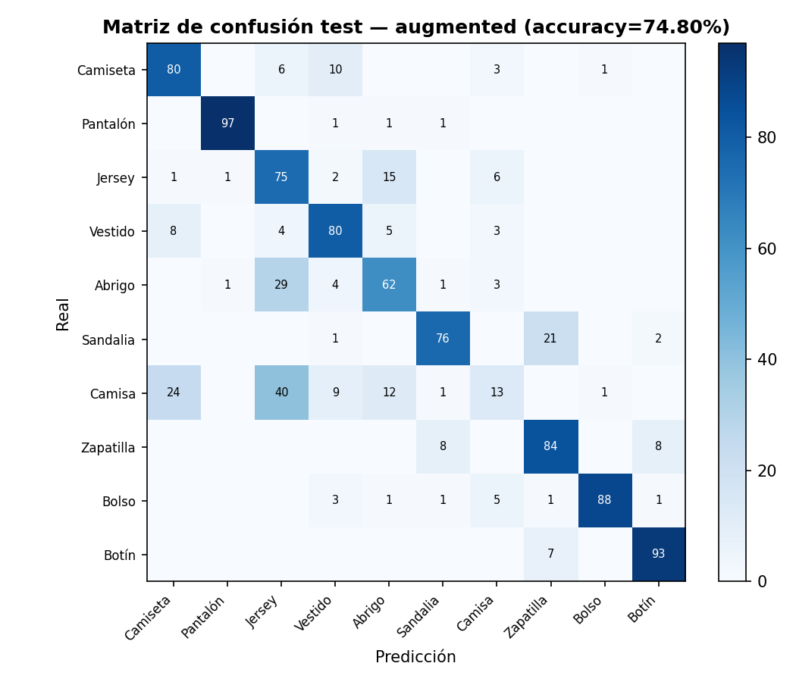

En **ambas** versiones, "Camisa" es con diferencia la clase más difícil (42/100 baseline,
16/100 con augmentation) — es un resultado bien conocido de Fashion-MNIST: una camisa comparte
silueta con la camiseta, el jersey y el abrigo, y sin color ni textura (son imágenes en escala
de grises de 28×28) el contorno es prácticamente toda la información disponible para
distinguirlas. Con augmentation ese problema se agrava: 29 de las 100 camisas de test se
confunden con "Jersey" (frente a 20 en el baseline) y 19 con "Abrigo" (frente a 10).

"Jersey" y "Abrigo" también se mueven bastante entre versiones, pero **en sentido contrario al
de una ejecución anterior de este mismo análisis** (con otra semilla): aquí "Jersey" **empeora**
con augmentation (72/100 → 66/100) mientras "Abrigo" **mejora** (66/100 → 83/100) — justo al
revés de lo que se observó en el run documentado previamente en este README. No es una
contradicción ni un error: es la confirmación directa, con datos, del punto que ya se apuntaba
aquí antes de medir la robustez frente a la semilla (ver esa sección más abajo) — el sentido
concreto en que se mueve la frontera Jersey/Abrigo con la augmentation depende de la
inicialización y el split concretos, no es un efecto estable y direccional. Lo que sí se repite
en ambas ejecuciones es que jersey y abrigo comparten silueta y son las clases donde la
augmentation geométrica más remueve la frontera de decisión — el *qué* se mueve es estable, el
*hacia dónde* no.

## Dataset completo + mini-batches — `cnn_fashion_mnist_full.py`

`cnn_fashion_mnist.py` usa full-batch: una única actualización de pesos por época, sobre toda
la muestra de golpe. Manejable con 2.400 imágenes, pero no escala. `cnn_fashion_mnist_full.py`
es la misma arquitectura y la misma metodología (split 60/20/20, early stopping por
validación, checkpoint del mejor punto, baseline vs augmented con los mismos pesos iniciales),
entrenada en cambio por **mini-batches de 32 imágenes** (1.313 por época) sobre las **70.000**
imágenes completas de Fashion-MNIST (exactamente 7.000 por clase — a diferencia de MNIST, aquí
sí está perfectamente equilibrado).

Mismo error clásico a vigilar que en `07-reconocimiento-digitos/digit_classifier_full.py`: el
gradiente se normaliza por el tamaño del **batch actual**, no por el de todo train — dejar el
denominador del full-batch original habría hecho que el entrenamiento no convergiera, sin
lanzar ningún error explícito.

| | Train / Val / Test | Accuracy baseline | Accuracy augmented | Tiempo total |
|---|---|---|---|---|
| Muestra reducida, full-batch | 2.400 / 600 / 1.000 | 79.50% | 76.20% | ~13,5 min (720 épocas en total) |
| Dataset completo, mini-batch | 42.000 / 14.000 / 14.000 | **88.84%** | **84.89%** | ~8,3 min (27 épocas en total) |

Dos cosas notables:

1. **Con 17,5x más datos, el entrenamiento tardó *menos* tiempo real**, no más — la versión
   full-batch necesita 324 épocas (baseline) y 396 (augmented), 720 en total, con solo 1
   actualización de pesos cada una; con mini-batches (1.313 actualizaciones por época) la red
   converge en 13 épocas (baseline) y 14 (augmented), 27 en total. Cada actualización individual
   es más barata (procesa 32 imágenes, no 2.400), y hacen falta muchísimas menos épocas
   completas para llegar al mismo sitio.
2. **La augmentation sigue por detrás del baseline en las dos escalas (84.89% < 88.84%;
   76.20% < 79.50%)**, pero la brecha **no se estrecha de forma consistente al crecer la
   muestra** -- 3,30 puntos con la muestra reducida frente a 3,95 con el dataset completo, al
   contrario de lo que sugería una ejecución anterior de este análisis (con otra semilla), que
   mostraba la brecha estrechándose. Es el mismo patrón que la sección de robustez frente a la
   semilla documenta más abajo: la dirección de "constante con la que crece la muestra" no es
   estable entre semillas, aunque el hecho de que augmentation quede por detrás sí lo es en las
   combinaciones de semillas probadas.

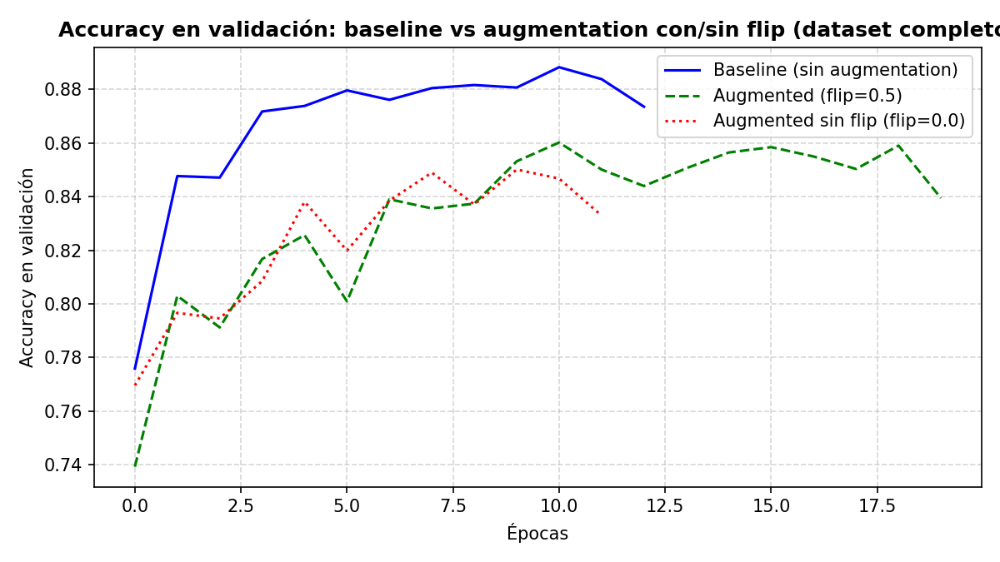

**Matrices de confusión (test, dataset completo)**:

**Baseline (88.84%)**:


**Con augmentation (84.89%)**:

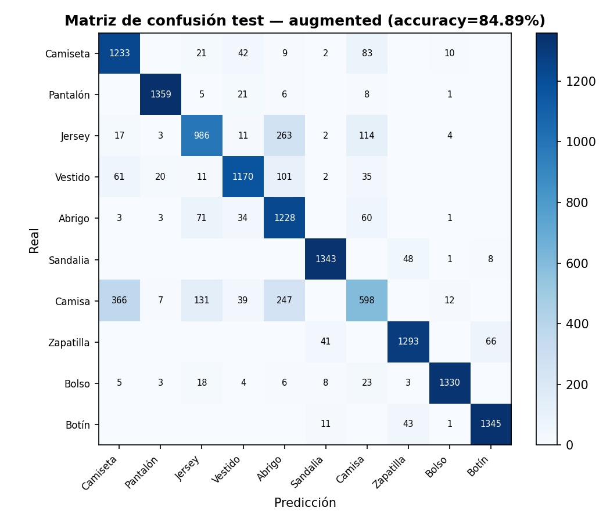

**Lectura**: "Camisa" sigue siendo, con diferencia, la clase más difícil en ambas versiones
(69.7% baseline, 42.7% con augmentation, sobre 1.400 camisas de test) — el mismo resultado
conocido de Fashion-MNIST que en la muestra reducida, ahora con mucha más muestra para
confirmarlo: camisa comparte silueta con camiseta, jersey y abrigo, y sin color ni textura el
contorno es toda la información disponible. Con augmentation la confusión se dispara: 247 de
1.400 camisas se leen como "Abrigo" (17,6%) y 131 como "Jersey" (9,4%), frente a 111 y 111
respectivamente en el baseline — la augmentation geométrica parece difuminar precisamente los
detalles de solapa/cuello que distinguen una camisa de un jersey o un abrigo, aunque -- igual
que en la muestra reducida -- cuál de las dos (Jersey o Abrigo) se lleva la mayor parte de esa
confusión varía entre ejecuciones.

## ¿Explica el flip horizontal por qué la augmentation va peor que el baseline?

La augmentation de este proyecto combina 4 transformaciones (`capas_cnn.augmentar_lote`): flip
horizontal, rotación, zoom y desplazamiento. A diferencia de dígitos manuscritos, varias
prendas de Fashion-MNIST no son simétricas en la práctica -- zapatillas, sandalias y botines
tienen una orientación de puntera concreta -- así que tenía sentido comprobar si el flip
específicamente es responsable de que `augmented` rinda peor que `baseline`, en vez de asumirlo.
Se entrenó una tercera variante, `augmented_sin_flip` (prob_flip=0.0, mismo resto de
augmentation), con la misma semilla de augmentation que `augmented` -- como `augmentar_lote`
consume los mismos números aleatorios en el mismo orden con independencia de `prob_flip`, las
rotaciones/zooms/desplazamientos son idénticos entre ambas variantes y la única diferencia real
es si se aplica el flip.

| | Baseline | Augmented (flip=0.5) | Augmented sin flip (flip=0.0) |
|---|---|---|---|
| Muestra reducida (2.400 train) | 79.50% | 76.20% | 75.40% |
| Dataset completo (42.000 train) | 88.84% | 84.89% | 85.49% |

**El flip no explica la brecha.** `augmented_sin_flip` sigue perdiendo frente al baseline en
las dos escalas (75.40% < 79.50%; 85.49% < 88.84%) -- si el flip fuera la causa real de que la
augmentation vaya peor, quitarlo debería cerrar esa brecha, y no la cierra en ninguna de las
dos. El movimiento que sí produce quitar el flip es pequeño y **cambia de signo entre escalas**
(−0,80 puntos a escala reducida, +0,60 a escala completa) -- del mismo orden que el ruido
esperable entre ejecuciones (semilla, orden de batches), no una señal consistente sobre la que
construir una explicación.

**La causa real de por qué la augmentation completa rinde peor que el baseline sigue abierta.**
La sospechosa principal, coherente con el punto 1 de la sección "Por qué tiene sentido" más
arriba, es el presupuesto de épocas: cada época de augmentation optimiza sobre una
transformación distinta por imagen, un objetivo más ruidoso que el baseline, y con early
stopping cortando en cuanto la validación deja de mejorar puede no haber margen para que el
beneficio de generalización llegue a compensar ese coste de optimización. No se ha verificado
directamente (haría falta, por ejemplo, entrenar con más paciencia o un techo de épocas más
alto y comprobar si el gap se cierra), así que se deja como hipótesis, no como conclusión. Un
resultado negativo sin explicar del todo es más honesto que uno explicado a medias.

**Sobre el efecto del flip por clase (Camisa, Jersey, Zapatilla...): se ha retirado el desglose
detallado que había aquí.** Una versión anterior de este análisis (con otra semilla, antes de
separar `seed_split`/`seed_modelo`/`SEED_DATOS` como se explica en el
[README raíz](../README.md)) reportaba efectos direccionales aparentemente consistentes entre
escalas -- "Camisa siempre peor con flip", "Jersey siempre mejor con flip". Al repetir el
análisis con la semilla ya separada correctamente, **esos efectos no solo cambiaron de
magnitud: cambiaron de signo** (Jersey pasa a ir peor con flip en las dos escalas; Camisa deja
de tener una dirección consistente entre escalas). Mantener una narrativa detallada por clase
que no sobrevive a un cambio de semilla habría sido presentar ruido como si fuera señal. La
lectura honesta es la de la sección "Robustez frente a la semilla" de abajo: a nivel agregado
(augmentation por detrás del baseline) el resultado es estable; a nivel de qué clase concreta
gana o pierde con el flip, no lo es con una sola ejecución por variante, y no se ha invertido el
tiempo de cómputo que costaría promediar el efecto del flip por clase sobre varias semillas.

## Robustez frente a la semilla

Todo lo anterior está basado en una única ejecución por variante (`seed_split=42,
seed_modelo=42`). Para saber si "baseline gana a augmented" y "el flip no explica la brecha"
son hallazgos reales o solo lo que tocó con esa semilla concreta, se repite cada variante con
**20 pares (seed_split, seed_modelo) sorteados de forma independiente**
(`python run_seed_sweep.py --solo 08-cnn-fullbatch --n 20` / `--solo 08-cnn-minibatch --n 20`,
ver [README raíz](../README.md) para la metodología completa — mismo N que el resto del
repositorio, pese al coste de cómputo: ~5h y ~2.4h respectivamente).

**Muestra reducida, full-batch:**

| Variante | Media | Desv. típica | Mínimo | Máximo |
|---|---|---|---|---|
| Baseline | 80.58% | 1.22% | 77.50% | 82.50% |
| Augmented | 76.53% | 1.45% | 74.40% | 79.60% |
| Augmented sin flip | 77.04% | 1.53% | 74.90% | 79.60% |

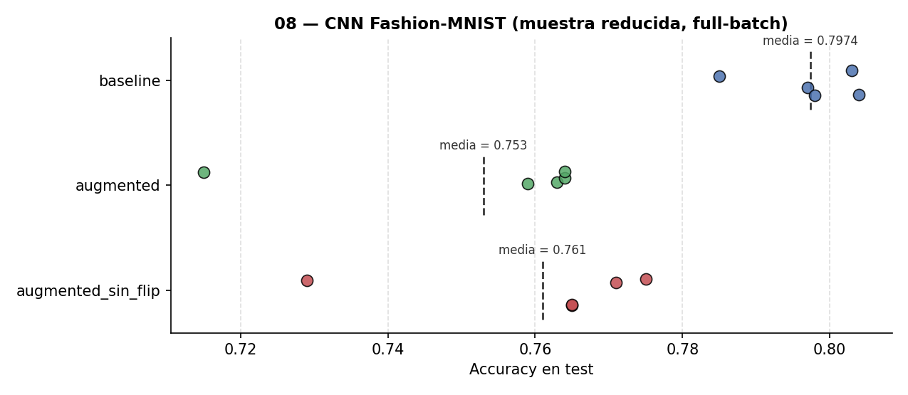

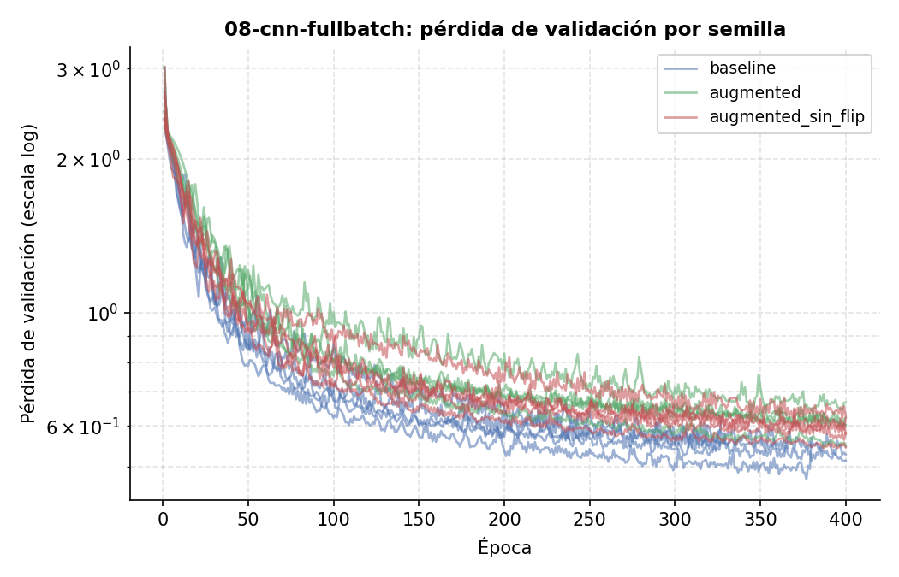

**Dataset completo, mini-batch:**

| Variante | Media | Desv. típica | Mínimo | Máximo |
|---|---|---|---|---|
| Baseline | 88.39% | 0.58% | 87.31% | 89.24% |
| Augmented | 85.08% | 0.98% | 82.44% | 86.64% |
| Augmented sin flip | 85.69% | 0.84% | 83.98% | 87.66% |

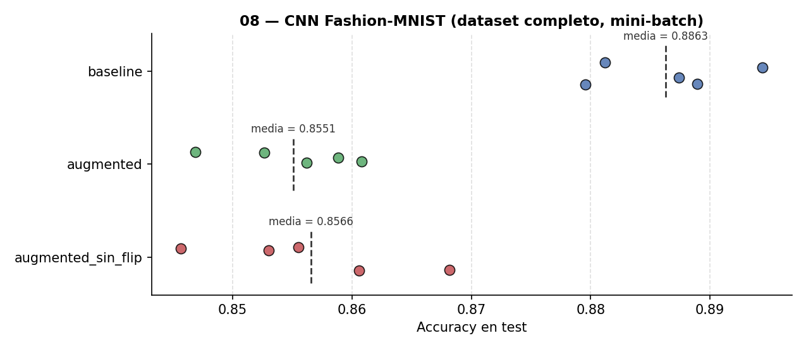

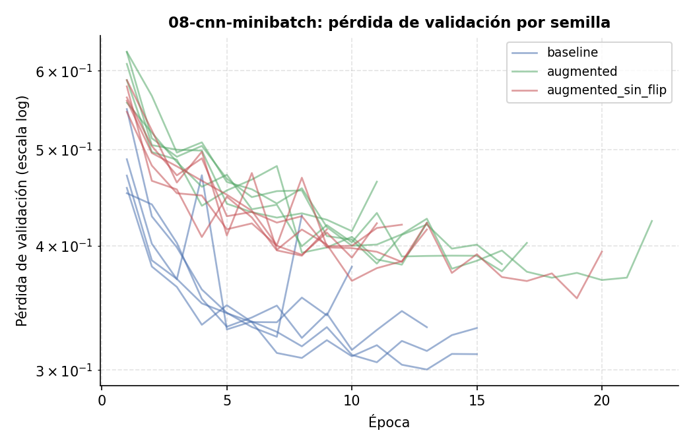

**Lo que se sostiene entre semillas (y lo que cambia al pasar de N=5 a N=20):**

1. **Baseline por delante de las dos variantes con augmentation en media, en las dos escalas —
   pero con N=20 aparece un solape en los extremos que con N=5 no se veía.** Las medias siguen
   claramente separadas (80.58% vs 77.04% reducida, 3.5 puntos; 88.39% vs 85.69% completa, 2.7
   puntos -- varias desviaciones típicas de distancia en ambos casos). Pero el peor caso del
   baseline ya no queda por encima del mejor caso de `augmented_sin_flip`: 3 de las 20 semillas
   de baseline (77.5–79.4% reducida) caen por debajo de su mejor resultado (79.6%), y 2 de 20
   (87.31–87.53% completa) caen por debajo de su mejor resultado (87.66%). Con N=5 los rangos no
   se solapaban y esta sección lo presentaba como un hallazgo sin matices; con cuatro veces más
   semillas se ve que las colas sí se tocan un poco, aunque la tendencia central (que es lo que
   importa para "¿augmentation ayuda aquí?") no cambia. La curva de pérdida por época lo sigue
   confirmando visualmente: las 20 líneas azules (baseline) quedan por debajo de las 40 líneas
   verdes/rojas (augmented/sin flip) casi todo el entrenamiento, en las dos escalas.
2. **`augmented` y `augmented_sin_flip` se solapan casi por completo en las dos escalas** (74.4–
   79.6% vs 74.9–79.6% reducida; 82.4–86.6% vs 84.0–87.7% completa) -- confirma con 20 semillas,
   no solo con una comparación puntual, la conclusión de la sección "¿Explica el flip
   horizontal...?": el flip no es lo que separa `augmented` del baseline.
3. **La augmentation añade varianza, pero la brecha frente al baseline es más pequeña de lo que
   sugería N=5, en las dos escalas.** Reducida: desviación típica de 1.45–1.53% en las variantes
   con augmentation frente a 1.22% en el baseline (~1.2x, no los ~2.5x que sugería N=5 con
   0.76% de baseline). Completa: 0.84–0.98% frente a 0.58% (~1.5x) -- aquí N=5 había sugerido que
   la diferencia de varianza "casi desaparecía" con el dataset completo (0.55–0.84% muy
   parejo entre las tres variantes); con N=20 se ve que la augmentation sigue añadiendo más
   varianza que el baseline también a esta escala, solo que de forma menos dramática que en la
   muestra reducida. Es un buen ejemplo de por qué N=5 era un tamaño de muestra arriesgado para
   afirmaciones sobre varianza en concreto (aunque bastara para la comparación de medias del
   punto 1).

## SGD vs Adam

Mismo experimento que en [`06-zonas-espirales`](../06-zonas-espirales/) y
[`07-reconocimiento-digitos`](../07-reconocimiento-digitos/) (ver sus README para la
explicación completa de `OptimizadorAdam`, implementado desde cero en `capas.py`), aquí
cruzado con las 3 variantes de augmentation y las 2 escalas de este proyecto: 6 combinaciones
por escala. `sgd_vs_adam.py` (full-batch) y `sgd_vs_adam_full.py` (mini-batch) no tocan
`cnn_fashion_mnist.py`/`cnn_fashion_mnist_full.py` -- reutilizan su `cargar_datos()`,
`evaluar()` y `augmentar_lote()`, y guardan sus propios resultados en `results_sgd_vs_adam/` /
`results_full_sgd_vs_adam/`. `CapaConv2D` (en `capas_cnn.py`) tiene el mismo optimizador
intercambiable que `CapaDensa` -- por defecto SGD, cero cambios de comportamiento en
`cnn_fashion_mnist.py`/`_full.py` si no se pide uno distinto.

**Robustez frente a la semilla (20 semillas por combinación,**
`python run_seed_sweep.py --solo 08-fullbatch-sgd-vs-adam --n 20` /
`--solo 08-minibatch-sgd-vs-adam --n 20`**)**:

**Muestra reducida, full-batch:**

| Variante | SGD | Adam (lr=0.001) | Diferencia |
|---|---|---|---|
| baseline | 80.58% ± 1.22% | **83.70% ± 1.42%** | +3.12 pts |
| augmented | 76.52% ± 1.45% | **81.19% ± 1.54%** | +4.67 pts |
| augmented_sin_flip | 77.04% ± 1.53% | **81.97% ± 1.11%** | +4.93 pts |

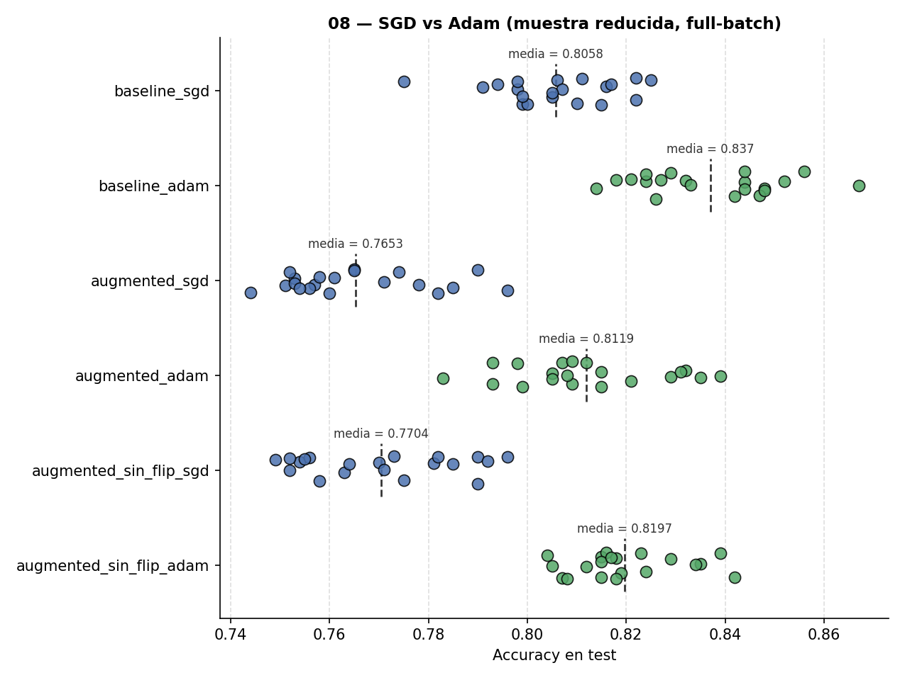


**Dataset completo, mini-batch:**

| Variante | SGD | Adam (lr=0.001) | Diferencia |
|---|---|---|---|
| baseline | 88.39% ± 0.58% | **89.58% ± 0.43%** | +1.19 pts |
| augmented | 85.08% ± 0.98% | **87.67% ± 0.53%** | +2.59 pts |
| augmented_sin_flip | 85.69% ± 0.84% | **88.03% ± 0.46%** | +2.34 pts |

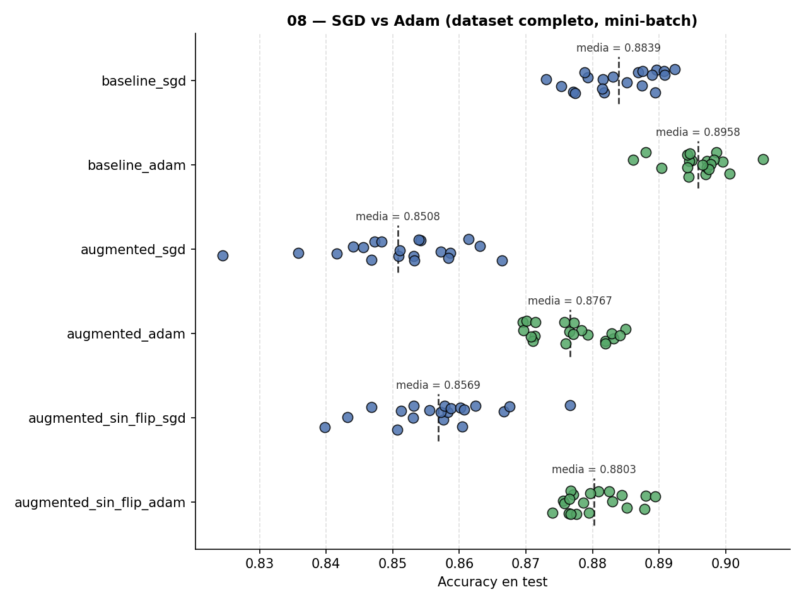


**Lectura honesta, distinta de la de 06 y 07**: aquí Adam no solo converge razonablemente
rápido, sino que además **gana en accuracy de forma consistente en las 6 combinaciones**, y con
menos varianza entre semillas (desviación típica típicamente un 30-50% menor que SGD). A
diferencia de 07-full-batch, donde la ventaja de accuracy de la ejecución canónica desaparecía
con 20 semillas, aquí se sostiene con claridad en las 6 comparaciones -- las distribuciones de
SGD y Adam prácticamente no se solapan en el dot-plot. La convergencia en épocas es más rápida
en full-batch (donde SGD parte de un learning_rate mucho más alto y sin adaptación) que en
mini-batch (donde SGD ya se beneficia de ~1.313 actualizaciones de pesos por época, así que
tiene menos margen de mejora en velocidad, aunque Adam lo siga superando en accuracy final).

Datos crudos en `results_sgd_vs_adam/metrics_seed_sweep.json` y
`results_full_sgd_vs_adam/metrics_seed_sweep.json`.

## Esquema B: split fijo vs split libre

Misma pregunta que en [`07-reconocimiento-digitos`](../07-reconocimiento-digitos/) (ver su
README para la explicación completa): `seed_split` fijo en 42 siempre, frente al split libre e
independiente de "Robustez frente a la semilla". Se ejecuta con
[`run_seed_sweep_esquemaB.py`](../run_seed_sweep_esquemaB.py), reutilizando
`sgd_vs_adam.py`/`sgd_vs_adam_full.py` sin tocarlos -- solo cambian las semillas.

**Muestra reducida, full-batch:**

| Variante | Split libre | Split fijo | Diferencia |
|---|---|---|---|
| baseline, SGD | 80.58% ± 1.22% | 79.39% ± 0.95% | -1.19 pts |
| baseline, Adam | 83.70% ± 1.42% | 81.85% ± 0.59% | -1.85 pts |
| augmented, SGD | 76.52% ± 1.45% | 74.63% ± 0.71% | -1.89 pts |
| augmented, Adam | 81.19% ± 1.54% | 78.74% ± 0.93% | -2.45 pts |
| augmented_sin_flip, SGD | 77.04% ± 1.53% | 75.83% ± 0.70% | -1.21 pts |
| augmented_sin_flip, Adam | 81.97% ± 1.11% | 79.59% ± 0.97% | -2.38 pts |

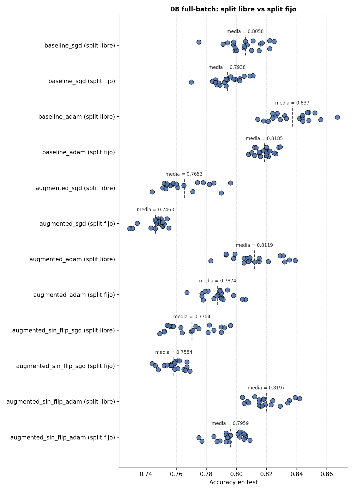

**Dataset completo, mini-batch:**

| Variante | Split libre | Split fijo | Diferencia |
|---|---|---|---|
| baseline, SGD | 88.39% ± 0.58% | 88.05% ± 0.48% | -0.34 pts |
| baseline, Adam | 89.58% ± 0.43% | 89.38% ± 0.36% | -0.20 pts |
| augmented, SGD | 85.08% ± 0.98% | 85.07% ± 0.71% | -0.01 pts |
| augmented, Adam | 87.67% ± 0.53% | 87.03% ± 0.65% | -0.64 pts |
| augmented_sin_flip, SGD | 85.69% ± 0.84% | 85.09% ± 0.81% | -0.60 pts |
| augmented_sin_flip, Adam | 88.03% ± 0.46% | 87.64% ± 0.60% | -0.39 pts |

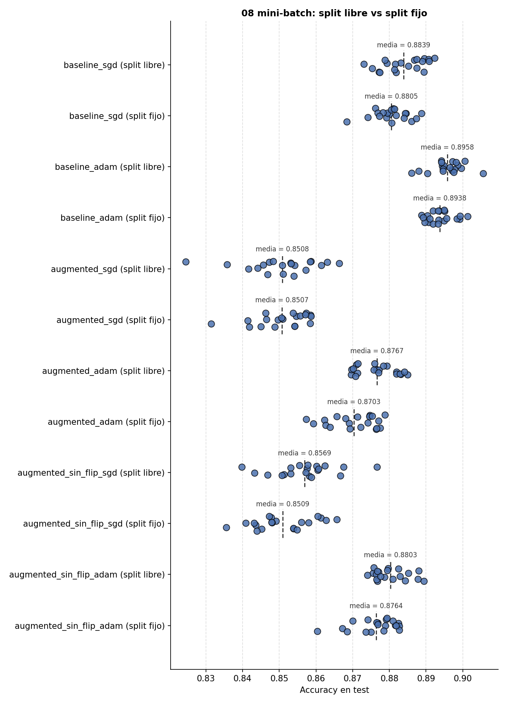

**Lectura, consistente con 07**: fijar el split reduce la desviación típica en las 12
combinaciones (aísla la varianza de inicialización, elimina la del split). Pero en full-batch
(2.400 imágenes) la media **baja** de forma consistente entre 1.2 y 2.5 puntos con split fijo
-- la partición `seed_split=42` resulta ser algo más difícil que la media de particiones
aleatorias sobre esta muestra reducida (al revés que en 07, donde esa misma partición 42 daba
una muestra algo más fácil: no hay ninguna razón para que una partición fija concreta sea
sistemáticamente mejor o peor entre proyectos distintos, cada uno con su propio dataset). En
mini-batch (42.000 imágenes) el efecto es mucho menor (-0.01 a -0.64 puntos) -- con más muestra,
importa menos qué partición concreta te toque, el mismo patrón que ya se veía en "Robustez
frente a la semilla". La conclusión práctica: split fijo no es una mejora gratis sobre split
libre -- gana en varianza, pero el punto medio que reporta depende de si la partición fija
elegida resultó representativa, y esto pesa más cuanto menos dato hay.

Datos crudos en `results_sgd_vs_adam/metrics_seed_sweep_esquemaB.json` y
`results_full_sgd_vs_adam/metrics_seed_sweep_esquemaB.json`.

## Learning rate decay

Sobre la configuración de referencia (Adam, mini-batch, variante `baseline` -- ver README raíz
para por qué esta es la base para todo lo nuevo del repo, sin repetir la comparación de
augmentation ya documentada arriba): `lr(época) = 0.001 · 0.9^época` frente al mismo Adam con
`learning_rate` constante. Reutiliza `crear_red()` de `sgd_vs_adam_full.py` --
[`lr_decay.py`](lr_decay.py).

| Variante | Accuracy test | Época del mínimo | Loss val. mínimo |
|---|---|---|---|
| Adam, lr constante | **89.88%** | 17 | 0.2712 |
| Adam, lr con decay | 89.79% | 17 | **0.2688** |

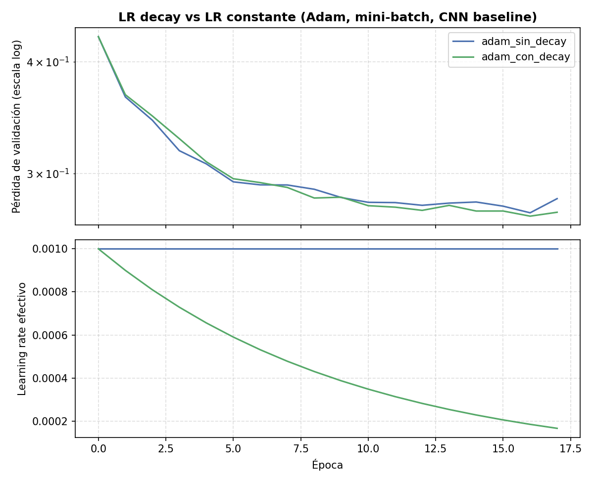

A diferencia de 07, aquí la diferencia es prácticamente ruido (-0.09 puntos de accuracy, loss
de validación ligeramente mejor con decay) -- resultado honesto, no todo lo que se prueba tiene
que mejorar las cosas de forma vistosa. Sí se nota un efecto más sutil en la curva: la versión
con decay oscila algo menos en las últimas épocas, consistente con pasos más pequeños cerca del
mínimo, aunque aquí no se traduzca en una accuracy final mejor.

## BatchNorm

`CapaBatchNorm2D` (nueva, en [`capas_cnn.py`](capas_cnn.py)) es la misma idea que
`CapaBatchNorm` de [`../capas.py`](../capas.py) pero normalizando por canal sobre (N, H, W) en
vez de solo sobre N -- todos los píxeles de un mismo canal comparten el filtro que los generó,
así que tiene sentido normalizarlos juntos. Verificada por diferencias finitas en
[`../tests/test_gradients.py`](../tests/test_gradients.py). Insertada tras cada `CapaConv2D` y
tras la primera `CapaDensa` (Conv/Dense → BatchNorm → LeakyReLU), sobre la variante `baseline`
de la configuración de referencia -- [`batchnorm.py`](batchnorm.py), no toca
`sgd_vs_adam_full.py`.

| Variante | Accuracy test | Época del mínimo | Loss val. mínimo |
|---|---|---|---|
| Adam, sin BatchNorm | **89.88%** | 17 | 0.2712 |
| Adam, con BatchNorm | 88.76% | 11 | **0.2616** |

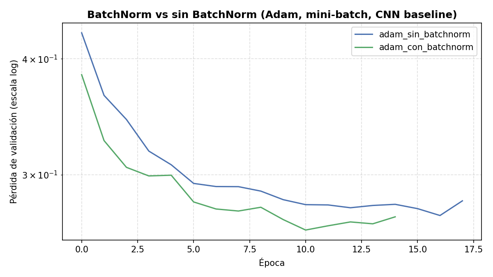

**Mismo patrón que en 07, más marcado aquí**: BatchNorm converge más rápido (mínimo en la
época 11, frente a la 17 sin él -- la curva verde queda claramente por debajo de la azul casi
todo el entrenamiento) y a una pérdida de validación mejor, pero la accuracy en test es peor
(88.76% frente a 89.88%). Confirma con una segunda red distinta que loss y accuracy no siempre
se mueven juntos, y que aquí BatchNorm gana en velocidad de convergencia sin ganar en la
métrica final que de verdad importa para clasificación. Con una red de este tamaño (~27.500
parámetros, 2 capas convolucionales) puede que la normalización interna no haga tanta falta
como en arquitecturas mucho más profundas, que es el escenario para el que se diseñó
originalmente.

## Reproducir

```bash
pip install -r ../requirements.txt
python cnn_fashion_mnist.py        # muestra reducida, full-batch (~13,5 min: 3 versiones)
python cnn_fashion_mnist_full.py   # dataset completo, mini-batch (~8,3 min: 3 versiones)
python sgd_vs_adam.py              # SGD vs Adam, full-batch (~32 min: 6 combinaciones)
python sgd_vs_adam_full.py         # SGD vs Adam, mini-batch (~13 min: 6 combinaciones)
python lr_decay.py                 # LR decay vs LR constante (~4 min)
python batchnorm.py                # BatchNorm vs sin BatchNorm (~3 min)

# Esquema B (split fijo) -- ver ../run_seed_sweep_esquemaB.py
python ../run_seed_sweep_esquemaB.py --solo 08-fullbatch-sgd-vs-adam --n 20
python ../run_seed_sweep_esquemaB.py --solo 08-minibatch-sgd-vs-adam --n 20
```

## Limitaciones

- `cnn_fashion_mnist.py` usa solo 2.400 imágenes de entrenamiento (de las 42.000 disponibles
  con el split completo) y full-batch, precisamente para que el bucle de entrenamiento sea
  simple de leer sin mini-batches de por medio — es una limitación intencionada, no un límite
  real: `cnn_fashion_mnist_full.py` entrena sobre el dataset completo con mini-batches y sube
  el baseline a 88.84% y el augmented a 84.89% (ver sección "Dataset completo + mini-batches"
  arriba). La augmentation sigue por detrás del baseline en las dos escalas, pero la brecha no
  se estrecha de forma estable al crecer la muestra (ver esa misma sección).
- Muestreo por vecino más cercano en `augmentar_lote()` (no interpolación bilineal como
  Keras/TensorFlow) — más simple de implementar a mano, con una pérdida de calidad de imagen
  menor pero no nula.
- Sin ajuste de hiperparámetros de la augmentation (ángulo, zoom, desplazamiento) — se
  usaron valores razonables por intuición, no se buscó la combinación óptima.
- El estudio con/sin flip descarta el flip como causa de que `augmented` rinda peor que
  `baseline`, pero no identifica la causa real -- la hipótesis del presupuesto de épocas (ver
  "¿Explica el flip horizontal...?" arriba) no se ha puesto a prueba entrenando con más
  paciencia o más épocas máximas. Queda como trabajo futuro, no como conclusión.
