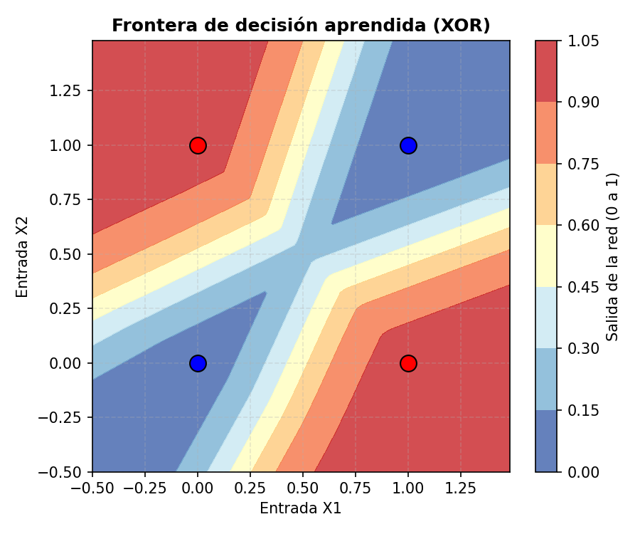
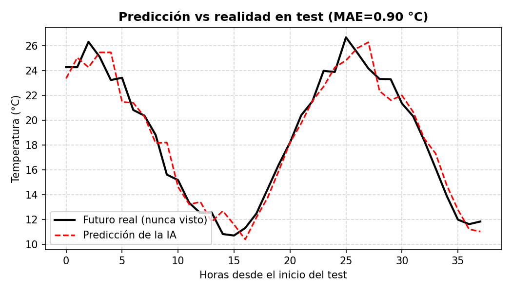
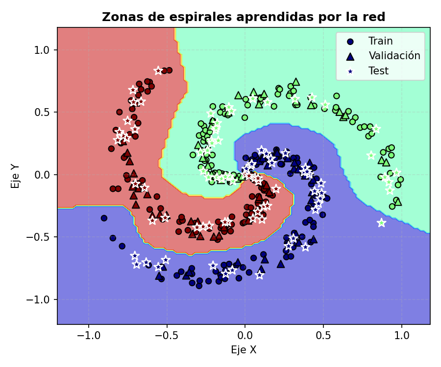

# RRNN — Redes neuronales desde cero, en NumPy puro

Ocho redes neuronales, de la más simple a la más compleja, **implementadas desde cero en
NumPy** — sin TensorFlow, sin Keras, sin PyTorch. Cada capa (densa, convolucional, pooling,
dropout, LeakyReLU, Sigmoide, Softmax) tiene su propio `forward()` y `backward()` escritos a
mano, para entender exactamente qué calcula el descenso de gradiente en cada paso, en vez de
delegarlo en un framework de producción.

Cada una de estas redes se escribió primero como un script suelto y se fue refinando hasta un
mini-framework orientado a objetos reutilizable ([`capas.py`](capas.py)) — primero entender el
mecanismo por dentro a mano, antes de usar un framework de producción como TensorFlow/Keras
sabiendo qué hace realmente por debajo.

## Resultados de un vistazo

**Antes de leer la tabla:** la columna "Resultado en test" es una única ejecución con semilla
fija (42) — una sola semilla puede tener suerte o mala suerte, y en algunos proyectos la
diferencia es grande: 03-tipos-clientes marca 100% con la semilla 42, pero repitiendo el
entrenamiento con 20 semillas independientes 2 de ellas no llegan ni al 92% (una colapsa a
33%); 05-precio-casas marca 10.299 € pero el rango real sobre esas mismas 20 semillas es
8.136–15.178 €. Por eso la tabla incluye también la media ± desviación típica sobre 20 semillas
independientes de cada proyecto — metodología completa en "Metodología: por qué tres semillas"
más abajo, detalle y gráficas en la sección "Robustez frente a la semilla" de cada README:

| # | Proyecto | Tipo | Resultado en test (semilla 42) | Media ± σ (N=20 semillas) |
|---|---|---|---|---|
| 01 | [Compuerta XOR](01-compuertas-logicas-xor/) | Clasificación binaria | 4/4 aciertos, loss 0.0016 | 0.0017 ± 0.0006 |
| 02 | [Celsius → Fahrenheit](02-celsius-fahrenheit/) | Regresión | MAE 0.0015 °F | 0.0139 ± 0.0382 °F |
| 03 | [Tipos de cliente](03-tipos-clientes/) | Clasificación (3 clases) | 100% accuracy | 96.25% ± 14.93% |
| 04 | [Temperatura día/noche](04-prediccion-temperatura-dia-noche/) | Regresión (serie temporal) | MAE 0.88 °C | 0.88 ± 0.02 °C |
| 05 | [Precio de una casa](05-precio-casas/) | Regresión | MAE 10.299 € | 11.907 € ± 1.696 € |
| 06 | [Zonas de espirales](06-zonas-espirales/) | Clasificación (3 clases) | 97.78% accuracy | 98.06% ± 1.34% |
| 07 | [Dígitos manuscritos (MNIST)](07-reconocimiento-digitos/) | Clasificación (10 clases) | 89.00% accuracy (97.46% con dataset completo, ver abajo) | 88.23% ± 1.76% (97.46% ± 0.24% completo) |
| 08 | [CNN Fashion-MNIST: baseline vs augmentation](08-cnn-fashion-mnist/) | Clasificación (10 clases) | 79.50% vs 76.20% (88.84% vs 84.89% con dataset completo, ver abajo) | 80.58% ± 1.22% (baseline, muestra reducida — ver README del proyecto para augmented y dataset completo) |

La desviación típica de 02 (±0.0382 °F) es mayor que su propia media (0.0139 °F) porque un solo
caso atípico entre 20 domina el número — no es un error de la tabla, es precisamente el tipo de
cosa que una sola cifra "de un vistazo" no deja ver (detalle en el README del proyecto).

Los proyectos 07 y 08 tienen además una variante `_full` (`digit_classifier_full.py`,
`cnn_fashion_mnist_full.py`) entrenada sobre el dataset **completo** (70.000 imágenes) por
**mini-batches**, en vez de la muestra reducida entrenada full-batch de la versión principal —
las dos versiones se dejan una junto a la otra a propósito, para poder comparar en el propio
repositorio qué gana el modelo al pasar de "muestra pequeña, 1 actualización de pesos por
época" a "dataset completo, miles de actualizaciones por época". Detalle en el README de cada
proyecto.

## Los 8 proyectos, de lo más simple a lo más complejo

Cada carpeta tiene su propio script reproducible, README con resultados reales (no solo
descritos: cada script se ejecutó para verificar las cifras) y tres visualizaciones
consistentes: **curva de aprendizaje**, **visualización de los datos** y **la matriz** —
matriz de confusión en los 5 proyectos de clasificación (01, 03, 06, 07, 08); en los 3 de
regresión (02, 04, 05) una matriz de confusión no tiene sentido matemático, así que se
sustituye por el equivalente honesto (predicho vs real), explicado en cada README. Debajo, una
imagen representativa de cada uno — en 02, 03, 07 y 08 es una animación (Manim) mostrando
arquitectura, forward, backward y resultado con la red real entrenándose en el momento; el
resto de gráficas y detalles están en el README de cada carpeta.

### 01 — [Compuerta XOR](01-compuertas-logicas-xor/)
Clasificación binaria no separable linealmente. **4/4 aciertos, loss 0.0016.**



### 02 — [Celsius → Fahrenheit](02-celsius-fahrenheit/)
Regresión con una sola neurona lineal. **MAE 0.0015 °F en test** (prácticamente exacto).


### 03 — [Tipos de cliente](03-tipos-clientes/)
Clasificación de 3 categorías. **100% accuracy en test.**


### 04 — [Predicción de temperatura día/noche](04-prediccion-temperatura-dia-noche/)
Regresión con ventana deslizante sobre un ciclo día/noche con ruido. **MAE 0.88 °C en test.**



### 05 — [Precio de una casa](05-precio-casas/)
Regresión con 2 variables (metros, habitaciones). **MAE 10.299 € en test.**


### 06 — [Zonas de espirales](06-zonas-espirales/)
Clasificación con frontera curva, red profunda de 2 capas ocultas. **97.78% accuracy en test.**



### 07 — [Dígitos manuscritos (MNIST)](07-reconocimiento-digitos/)
Clasificación de 10 clases + demo interactiva para dibujar y reconocer en vivo. **89.00%
accuracy en test.**


### 08 — [CNN sobre Fashion-MNIST: baseline vs data augmentation](08-cnn-fashion-mnist/)
Convolución + pooling + dropout, también 100% NumPy (técnica im2col). Entrenada dos veces con
los mismos pesos iniciales para medir el efecto real de la augmentation. **79.50% accuracy
(baseline) vs 76.20% (con augmentation)** — con este presupuesto de épocas, la augmentation
sigue por detrás del baseline (ver README del proyecto para el análisis completo).


## El mini-framework — `capas.py`

Las clases `CapaDensa`, `ActivacionLeakyReLU`, `ActivacionSigmoide` y `ActivacionSoftmax` se
escriben **una sola vez** en [`capas.py`](capas.py) y se reutilizan en 6 de los 8 proyectos (01
y 03 a 07), en vez de copiar y pegar el mismo bucle de entrenamiento cada vez. El 02 es una
excepción deliberada: es una sola neurona lineal sin capas ocultas ni activaciones, así que
implementa `A = X·W + b` directamente con NumPy en vez de instanciar `CapaDensa` -- reutilizar
el framework ahí habría escondido precisamente el cálculo mínimo que ese proyecto existe para
mostrar. El proyecto 08
amplía el mismo patrón con capas convolucionales propias en
[`08-cnn-fashion-mnist/capas_cnn.py`](08-cnn-fashion-mnist/capas_cnn.py) (`CapaConv2D`,
`CapaMaxPool2D`, `CapaFlatten`, `CapaDropout`), reutilizando `CapaDensa` y las activaciones de
`capas.py` para su parte totalmente conectada. Cada capa sabe calcular su propio gradiente y
actualizar sus propios pesos; el bucle de entrenamiento no necesita saber qué hay dentro de
cada capa, solo encadenarlas:

```python
# Forward: pasar los datos por cada capa en orden
activacion = X
for capa in red:
    activacion = capa.forward(activacion)

# Backward: recorrer las capas al revés, cada una devuelve el gradiente de la anterior
gradiente = ...  # gradiente de la función de pérdida
for capa in reversed(red):
    gradiente = capa.backward(gradiente, learning_rate)
```

Es, en miniatura, el mismo patrón que usan `Sequential` y `model.fit()` en Keras — aquí escrito
a mano para verlo por dentro.

Quién actualiza los pesos dentro de ese `backward()` también es intercambiable: `CapaDensa`
delega en un `optimizador` (`OptimizadorSGD` por defecto -- descenso de gradiente puro, el
comportamiento de siempre -- u `OptimizadorAdam`, con media móvil del gradiente y de su
cuadrado por parámetro, implementado desde cero siguiendo [Kingma & Ba,
2015](https://arxiv.org/abs/1412.6980)). Ver la comparación SGD vs Adam en el README de
[`06-zonas-espirales`](06-zonas-espirales/) para cuándo importa el cambio y cuándo no.

## Reproducir cualquier proyecto

```bash
pip install -r requirements.txt
cd 01-compuertas-logicas-xor && python xor_gate.py
```

(cada carpeta tiene su propio script principal; ver el README de cada una).

## Verificar los gradientes escritos a mano

[`tests/test_gradients.py`](tests/test_gradients.py) comprueba, por diferencias finitas, que
el `backward()` de cada capa (`CapaDensa`, las activaciones, y `CapaConv2D`/`CapaMaxPool2D`
del proyecto 08) calcula el gradiente correcto — no una afirmación en un README, un test que
se ejecuta:

```bash
pip install -r requirements.txt
pytest tests/test_gradients.py -v
```

## Metodología: por qué train / validación / test, y no solo train / test

Los 7 proyectos con early stopping (02 a 08, todos salvo el 01, que solo tiene 4 combinaciones
posibles de entrada y no admite split) usan un split de **tres** partes, no dos: **train**
(ajusta los pesos), **validación** (decide cuándo activar el early stopping) y **test** (se
evalúa una única vez, con la red ya entrenada y congelada, y no participa en ninguna decisión
anterior). Es el fix al error clásico de "fuga de información vía el conjunto de test" (usar
el propio test para decidir cuándo parar de entrenar, lo que contamina la cifra final que se
reporta como si fuera una estimación limpia de generalización). En el proyecto 08 en concreto,
este split resuelve además el problema de raíz de la versión anterior: baseline y augmented ya
no necesitan que nadie iguale manualmente su criterio de parada para poder compararse de forma
justa — cada uno para solo cuando su propia validación dice que ya no mejora, sin que el
experimentador tenga que mirar ninguna cifra de test para decidir nada. El detalle de cada
split (tamaños, y por qué en 04 el split respeta el orden temporal) está en el README de cada
proyecto.

El número de épocas configurado en cada proyecto (`epochs` / `EPOCHS_MAX`) es un **techo de
seguridad**, no un objetivo: existe solo para que el bucle no corra indefinidamente si nunca
converge. La cifra real de cuánto entrenar la decide la validación. Que un proyecto agote ese
techo sin que el early stopping llegue a activarse (02, 03, 06, y las tres variantes de 08 a
muestra reducida -- baseline, augmented y augmented_sin_flip) es tan válido como que se corte a
mitad de camino (04, 05, 07, y las tres variantes de 08 a dataset completo) — ambos son el
mecanismo funcionando, no una carencia que justificar.

### Checkpoint del mejor punto de validación

El early stopping detecta que hace falta parar comparando la ventana de las últimas
`PACIENCIA_EARLY_STOP` épocas contra la de referencia — necesita esa ventana completa para
confirmar que la validación ya no mejora, así que el bucle corta ~`PACIENCIA_EARLY_STOP` épocas
**después** del mínimo real de `loss_val`, no en él. Quedarse sin más con los pesos de la época
de corte sería, por tanto, quedarse con pesos ligeramente peores que los del mínimo.

Los 7 proyectos con early stopping guardan una copia de los pesos (`W`/`b` de cada capa con
parámetros propios — `CapaDensa`, y además `CapaConv2D` en el proyecto 08) cada vez que
`loss_val` marca un nuevo mínimo, y los restauran al salir del bucle, tanto si se corta por
early stopping como si se agota el techo de épocas. El detalle que importa es `.copy()`: sin
copiar los arrays se guardarían referencias que se siguen modificando en cada paso de
gradiente, y "restaurar" acabaría dejando los pesos finales en vez de los del mínimo — un bug
silencioso fácil de no notar porque el código no lanza ningún error.

### Full-batch vs. mini-batch: las variantes `_full` de 07 y 08

El resto del repo entrena **full-batch**: toda la muestra de golpe, una única actualización de
pesos por época. Es lo más simple de leer y suficiente con muestras pequeñas, pero no escala —
con decenas de miles de imágenes, seguir haciendo full-batch significaría 1 sola actualización
de pesos por época sobre una matriz enorme. `07-reconocimiento-digitos/digit_classifier_full.py`
y `08-cnn-fashion-mnist/cnn_fashion_mnist_full.py` entrenan la misma arquitectura sobre el
dataset **completo** (70.000 imágenes) por **mini-batches** en vez de una muestra reducida
full-batch — mismo split 60/20/20, mismo early stopping y checkpoint por validación, distinto
solo el tamaño de muestra y el bucle de actualización de pesos. Se dejan como scripts
independientes (no sustituyen a los originales) para que ambos resultados queden documentados
uno junto al otro y se pueda comparar directamente qué gana el modelo con más muestra.

Error clásico a vigilar al convertir un bucle full-batch en mini-batch: el gradiente de la capa
de salida se normaliza por el tamaño del **batch actual** (`Yb.shape[0]`), no por el tamaño de
todo el conjunto de train (`Y_train.shape[0]`). Dejar el denominador del full-batch original es
un bug silencioso — no lanza ningún error, simplemente dispara la escala del gradiente por un
factor igual al número de batches por época, y el entrenamiento diverge o no converge en
absoluto sin que quede claro por qué.

## Metodología: por qué tres semillas (y por qué no varía la de los datos)

Una única `np.random.seed(SEED)` mezclaba a la vez varias cosas distintas: qué datos existen,
quién va a train/val/test, los pesos iniciales, y (en 08) qué neuronas apaga el dropout o qué
transformación de augmentation le toca a cada imagen. Con una sola ejecución no había forma de
saber si un resultado era representativo del método o si esa semilla concreta tuvo suerte. Cada
proyecto separa ahora tres semillas independientes:

- **`SEED_DATOS`** (constante, nunca es argumento): gobierna solo qué datos existen — en 02-06,
  la generación sintética; en 01, 07 y 08 no aplica de verdad porque los datos son fijos (las 4
  filas de XOR) o reales y descargados (MNIST/Fashion-MNIST).
- **`seed_split`**: qué ejemplos van a train/validación/test (o, en 07/08, qué imágenes se
  muestrean de la población real). Sin efecto en 01 (no hay split) ni en 04 (split cronológico,
  no aleatorio).
- **`seed_modelo`**: inicialización de pesos y, donde aplica, las máscaras de dropout, el orden
  de los mini-batches y las transformaciones de data augmentation — todo lo que ocurre
  *durante* el entrenamiento, no al definir el problema.

**Por qué `SEED_DATOS` se queda fija.** Variar también la semilla de los datos respondería a una
pregunta distinta y menos interesante: no "¿es robusto el entrenamiento a su propia
aleatoriedad?", sino "¿cuánto cambia el resultado si cambio el problema?" — cada ejecución
generaría un dataset sintético distinto, mezclando dos fuentes de varianza en un solo número (la
sensibilidad del modelo a la inicialización/orden, que es lo que interesa medir, con el ruido de
muestreo de un generador sintético arbitrario, que no lo es). Además rompería comparaciones que
ya dependen de un dataset fijo — en 08, baseline/augmented/augmented_sin_flip solo son
comparables de forma justa si entrenan sobre exactamente los mismos datos.

**Cómo se mide la robustez.** [`run_seed_sweep.py`](run_seed_sweep.py) repite cada proyecto con
N pares `(seed_split, seed_modelo)` sorteados de forma **independiente** entre sí (no atados, no
en rejilla) — es una estimación Monte Carlo estándar de la media y la varianza del resultado
frente a la semilla, no una técnica con nombre propio ni una rejilla cruzada: con semillas
aleatorias no hay ninguna relación de orden entre "semilla 3" y "semilla 4" que una tabla o un
mapa de calor pudiera mostrar con sentido, así que el resultado se reporta como
media ± desviación típica (y a veces el rango completo, cuando hay valores atípicos que vale la
pena señalar). N=20 en las 13 unidades del repositorio (incluido el 08, pese a que cada
ejecución de su CNN tarda varios minutos y el barrido completo de sus dos variantes ronda las
7-8 horas de cómputo). [`plot_seed_sweep.py`](plot_seed_sweep.py) genera, a partir de esos datos, un
dot plot con las N ejecuciones y su media (`seed_sweep.png`); `run_seed_sweep.py` genera además,
en la misma pasada, una gráfica con las N curvas de pérdida de validación superpuestas en escala
logarítmica (`seed_sweep_curvas.png`) — la forma de cada curva (dónde converge, si corta antes)
es más informativa que una tabla época a época. Cada proyecto documenta su resultado en la
sección "Robustez frente a la semilla" de su propio README, con los datos crudos en
`results/metrics_seed_sweep.json`.

## Limitaciones generales

- Todos los datasets son sintéticos o muestras reducidas (excepto MNIST en el proyecto 07 y
  Fashion-MNIST en el 08, que son reales pero se usa solo una muestra de cada uno) — el
  objetivo es demostrar el mecanismo de aprendizaje correctamente implementado, no maximizar
  el rendimiento en un benchmark.
- Sin GPU — todo corre en CPU, incluida la CNN del proyecto 08 (la convolución se vectoriza
  con la técnica im2col, ver su README, en vez de con bucles Python por píxel); no escalaría a
  datasets grandes sin reescribir en un framework de producción (TensorFlow/Keras, PyTorch...).
- Con datasets tan pequeños como los de 02 (30 ejemplos) o 05 (150), separar un tercer split
  de validación deja mucha varianza en la cifra final de test — **medido, no solo advertido**:
  ver la sección "Robustez frente a la semilla" de cada README (02 llega a variar más de treinta
  veces respecto a su mediana entre semillas, de 0.0014 a 0.1756 °F de MAE). El objetivo de
  estos proyectos es demostrar el mecanismo y la metodología correcta, no una estimación de
  error robusta a gran escala.

## Licencia

[MIT](LICENSE).
